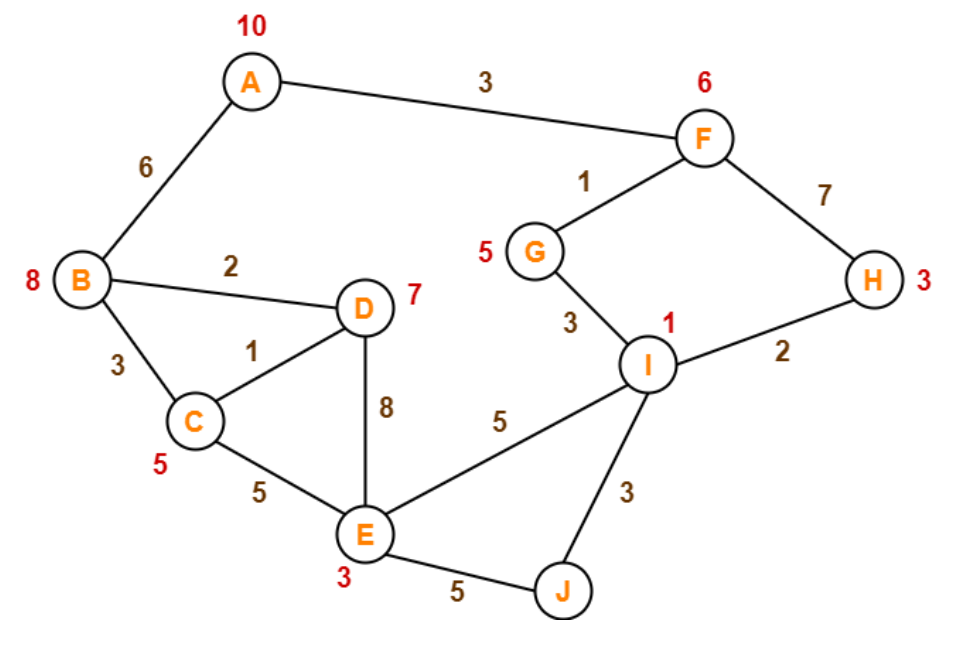
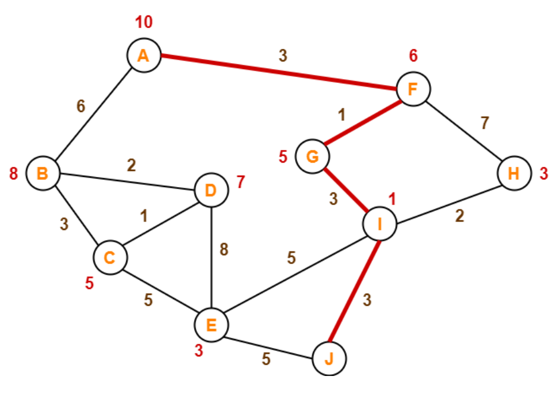
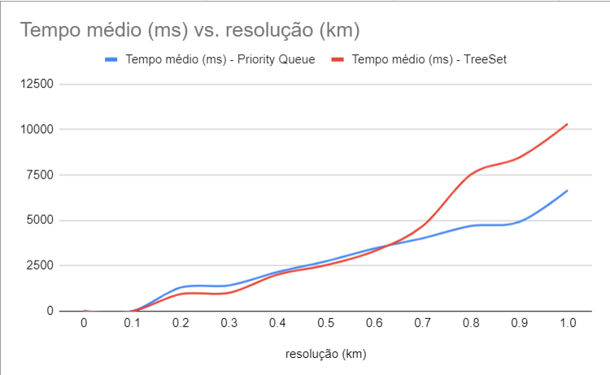
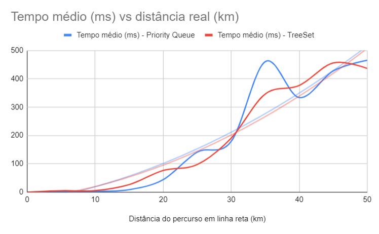

# Introdução

Voos em baixa altitude, principalmente em áreas montanhosas, é considerado uma tarefa complexa utilizada em diversas aplicações. Evitar detecções inimigas e melhorar as chances de sobrevivência são os principais propóstios no setor militar. Além disso, no setor civil é usada para reconhecimento de baixo nível, entrega de material em locais remotos, busca e resgate, e evacuação de vítimas (JIN et al., 2022).  Além disso, serve em situações de terremotos, em que é necessário se aproximar das construções (QI et al., 2016), ou na estimativa de rendimento e precisão na agricultura (REZA et al., 2019). Dessa forma, tornar esses voos mais seguros e otimizados é essencial para que tais propósitos sejam atendidos de forma rápida e da melhor forma possível.

Entretanto, nesse tipo de voo o risco iminente de colisão com o solo (CFIT) é alto. Acidentes de CFIT ocorrem quando uma aeronave, sob o controle de um piloto, atinge involuntariamente um terreno, água ou obstáculos (MATTESON, 2001). Em voos comerciais, mais de 30% dos acidentes fatais são categorizados como CFIT (ARTHUR III, 2003). Assim, no setor militar é imprescindível a construção de uma trajetória de voo que utiliza o terreno ao seu favor para evitar detecções, evadindo sistemas de monitoramento, e ao mesmo tempo reduz as chances de colisão. Para tentar amenizar esse problema allgumas soluções já são desenvolvidas com a finalidade de garantir maior segurança ao piloto.

Uma delas é o Terrain Following. Seu principal objetivo é manter uma distância mínima definida acima do terreno e voar rapidamente, de modo a minimizar os riscos de ser detectado e rastreado (Lu e Pierson, 1995). Ao buscar cobertura no solo para evitar detecção, o terreno acidentado e perigoso, juntamente com o objetivo de voar em alta velocidade próximo ao solo, se traduz em um problema de controle altamente restrito. Mesmo o mapa de maior resolução pode não ser capaz de avisar sobre obstáculos inesperados. Essas informações só podem ser obtidas em tempo real por meio de varreduras de sensores durante o voo. Isso destaca a necessidade de um algoritmo eficiente que possa incorporar novos conhecimentos de obstáculos obtidos pelos sensores na otimização da trajetória em tempo real, permitindo o um replanejamento dinâmico. 

Além disso, devido à proximidade do veículo com muitas restrições variáveis, manobras ágeis são necessárias, o que aumenta o risco de colisão(LAPP, 2004). Consequentemente, o sistema deve levar em consideração diversos aspectos como o envelope de voo da aeronave específica, seu potencial de subida (Climb rate [ft/s]), a manobrabilidade lateral da aeronave (Turn rate [deg/sec]), velocidade operacional, teto de operação, assim como aspectos geográficos da região em questão.

Neste artigo, nós propomos uma metodologia que se baseia no uso de entradas, como os dados da região geográfica de operação, o banco de dados de elevação, as zonas de exclusão (restrições) e o ponto de partida e de destino, para a construção de um grafo incompleto e direcionado que representa a trajetória mais otimizada para tal percurso. Buscando-se obter o caminho mais otimizado, será priorizada, pelo algoritmo, a rota que suprir os requisitos e parâmetros de entrada, devendo esta, não atingir pontos de exclusão, respeitar os limites de voo da aeronave, como velocidade máxima, raio de curvatura e outros, além de buscar diminuir o consumo de combustível e distância entre o ponto inicial e final, passando por localizações pré-definidas, caso estas sejam especificadas.

Os principais benefícios de nossa solução são uma visão completa do terreno e da rota, melhoria do consumo de combustível, redução de custos, economia de recursos e otimização do tempo na elaboração das rotas. Além disso, poderá ser integrada com produtos existentes que visam amenizar o atual problema. Dessa forma, o presente artigo irá contribuir com a apresentação de um modelo capaz de tornar as missões de voo em baixa altitude mais seguras e otimizadas, evitando acidentes de CFIT, gerando um maior sucesso das mesmas, e consequentemente, garantindo os propósitos de voos em baixa altitude.

# Descrição do problema

# Trabalhos relacionados

Com o avanço da tecnologia, os helicópteros autônomos têm se mostrado uma alternativa promissora para operações de baixa altitude em terrenos montanhosos. A partir disso, foi proposto um framework de controle autônomo de operações de helicópteros não tripulados em voo de baixa altitude em terrenos montanhosos. O objetivo é permitir que o helicóptero execute operações de forma autônoma, sem a intervenção humana constante. O framework inclui 3 módulos principais: percepção, tomada de decisão e controle. O módulo de percepção utiliza sensores para coletar informações do ambiente, enquanto o módulo de tomada de decisão utiliza um algoritmo de planejamento de trajetória para determinar a melhor rota para o helicóptero. O módulo de controle utiliza um controlador PID para garantir que o helicóptero siga a trajetória planejada e evite obstáculos. O Framework permite que o helicóptero execute operações de forma autônoma em terrenos montanhosos, o que pode ser útil em tarefas como inspeção de linhas de energia e monitoramento de áreas remotas. No entanto, O framework não leva em consideração a interação do helicóptero com outras aeronaves ou com humanos, o que pode ser um problema em áreas com alto tráfego aéreo ou densidade populacional.

O artigo "Search and rescue rotary‐wing uav and its application to the lushan ms 7.0 earthquake" apresenta um sistema de busca e resgate com um helicóptero não tripulado (UAV) de asa rotativa e sua aplicação no terremoto de magnitude 7.0 em Lushan, China, em 2013 (QI et al,2016). O sistema é composto por um UAV, estação de controle terrestre e um sistema de visão em tempo real. O UAV é capaz de voar em ambientes complexos e coletar informações em tempo real por meio de câmeras e sensores. A estação de controle terrestre permite que os operadores controlem o UAV e recebam informações em tempo real. O sistema de visão em tempo real é capaz de fornecer informações detalhadas sobre a área de busca e resgate, permitindo que a equipe de resgate tome decisões informadas. O sistema foi testado em uma missão de busca e resgate no terremoto de Lushan, e os resultados mostraram que o UAV foi capaz de localizar vítimas em áreas de difícil acesso e fornecer informações úteis para a equipe de resgate. O artigo conclui que o sistema de busca e resgate com UAVs pode ser uma solução eficaz para situações de desastres naturais. Os resultados dos testes mostraram que o sistema foi capaz de localizar vítimas em áreas de difícil acesso e fornecer informações úteis para a equipe de resgate. Todavia, o custo de implementação do sistema pode ser alto, uma vez que requer UAVs, sensores e equipamentos especializados.

Em "Rice yield estimation based on K-means clustering with graph-cut segmentation using low-altitude UAV images"(REZA et al., 2019), os autores propõem um método para estimar o rendimento do arroz usando imagens de UAV (veículos aéreos não tripulados) obtidas a baixa altitude. O método é baseado em dois processos principais: segmentação e classificação. A segmentação é realizada usando um algoritmo de corte de gráficos para separar as plantas do fundo. A classificação é feita usando o algoritmo de clusterização K-means para identificar diferentes estágios de crescimento das plantas de arroz. O rendimento é estimado usando uma equação que relaciona o número de plantas por metro quadrado com o rendimento por hectare. Os resultados mostram que o método proposto é capaz de estimar o rendimento do arroz com alta precisão e pode ser uma ferramenta útil para os agricultores e pesquisadores na tomada de decisões em relação ao cultivo de arroz. O uso de UAVs  pode trazer vantagens em termos de custo e tempo, já que a coleta de dados pode ser feita de forma mais rápida e eficiente do que as medições manuais. No entanto, Os algoritmos utilizados podem exigir habilidades técnicas avançadas para implementação e ajuste, o que pode dificultar a replicação da técnica por outros pesquisadores ou produtores rurais.

"Controlled Flight into Terrain: How the Airlines and the Federal Aviation Administration are Addressing the Problem" (MATTESON, 2001) discute a questão de voos controlados contra o terreno (CFIT, na sigla em inglês), que ocorrem quando uma aeronave em pleno voo colide com o solo ou outras obstruções devido a erros humanos ou falhas técnicas. O autor apresenta estatísticas sobre o número de acidentes desse tipo e destaca a importância de se tomar medidas para prevenir futuras ocorrências. O autor também enfatiza a importância de tecnologias avançadas e treinamento adequado dos pilotos para garantir a segurança das operações aéreas.

O tema da segurança em operações aéreas é crucial e tem sido objeto de estudos e aprimoramentos constantes ao longo dos anos. O artigo "CFIT prevention using synthetic vision" (ARTHUR III, 2001) destaca a gravidade dos acidentes CFIT e a importância das iniciativas da FAA e das companhias aéreas para prevenir futuras ocorrências. O autor enfatiza a importância de tecnologias avançadas e treinamento adequado dos pilotos para garantir a segurança das operações aéreas. Como limitações do estudo, podemos citar, por exemplo, a concentração exclusiva em uma abordagem específica para prevenir o voo controlado para o solo (CFIT) usando visão sintética, sem considerar outros fatores que podem contribuir para o problema. 

Ping Lu e Bion L. Pierson publicaram um estudo no Journal of Guidance, Control, and Dynamics que descreve uma metodologia para gerar trajetórias ótimas em aviões militares de asa fixa, visando um voo de seguimento de terreno. O artigo descreve a modelagem matemática do problema, considerando a dinâmica do avião e as limitações de segurança, bem como o terreno e as características ambientais. O algoritmo proposto para gerar as trajetórias é baseado em programação dinâmica, com o objetivo de minimizar o consumo de combustível, atender aos requisitos de segurança e manter a aeronave a uma altitude segura em relação ao terreno. O artigo apresenta resultados de simulações para validar a metodologia proposta e demonstra que as trajetórias geradas são efetivas e seguras. O trabalho contribui para a área de navegação de aviões militares e pode ter aplicações em outras áreas, como aeronaves civis e sistemas de controle de tráfego aéreo. Um dos pontos positivos do artigo é que o estudo apresenta resultados de simulações que demonstram a efetividade e segurança das trajetórias geradas pela metodologia proposta, o que fornece evidências empíricas da viabilidade da abordagem.

O segmento de terrenos em voos de baixa altitude é um desafio constante na aviação. Para evitar colisões, é fundamental manter uma distância segura em relação ao terreno. Nesse contexto, a tese de doutorado LAPP, de Tiffany Rae, desenvolvida no Massachusetts Institute of Technology (MIT), propõe uma técnica inovadora de controle de voo baseada no controle preditivo de modelos. O objetivo é ajustar continuamente o voo com base em leituras do terreno, considerando diversos fatores, como a dinâmica do vento, altitude, velocidade, aceleração e ângulo de inclinação da aeronave. Essa técnica tem o potencial de melhorar significativamente a segurança e precisão da navegação em voos de baixa altitude.

Os estudos mencionados acima tratam de aplicações de tecnologia de veículos aéreos não tripulados (UAVs) em diferentes áreas, como busca e salvamento, inspeção de linhas de energia, monitoramento de áreas remotas e estimativa de rendimento agrícola. Eles mostram que o uso de UAVs pode ser vantajoso em termos de eficiência e precisão na coleta de dados e informações, mas também destacam a necessidade de considerar questões técnicas e de segurança, como a interação com outras aeronaves e a intervenção humana em situações críticas.

# Metodologia 

Nesta seção, introduziremos os detalhes e procedimentos realizados para chegar na solução do planejador de trajetórias em baixa altitude. O processo de construção do planejador pode ser dividido na Analise mercadológica e a análise e modelagem do problema.

## 1 - Analise mercadológica

O planejamento de trajetória para voos em baixa altitude é uma técnica utilizada em sistemas de controle de voo de aeronaves para planejar e executar trajetórias seguras e eficientes em ambientes com obstáculos e/ou terreno acidentado. Essa técnica é essencial em missões de mapeamento e inspeção, em que é importante garantir que a aeronave siga uma trajetória e evite colisões com obstáculos.
Para iniciarmos o projeto com total entendimento do problema foram realizadas pesquisas preliminares para contextualização, utilizando ferramentas como matriz fofa, canvas da proposta de valor entre outros artefatos que podem ser consultados …

## 2 - Análise e modelagem do problema

O planejador de trajetórias para voos em baixa altitude utiliza uma variedade de dados e informações para planejar uma rota otimizada para as aeronaves. Isso inclui, informações sobre a localização e altura do terreno — mapas topográficos no formato dt2 obtidos em [inserir data do gdal] — assim como informações sobre a capacidade da aeronave: velocidade máxima, capacidade de manobra e combustível, por exemplo.

A abordagem para o planejamento das rotas é com o uso de algoritmos, que determinam a melhor trajetória para a aeronave a seguir com base nos dados disponíveis. O algoritmo é baseado em grafos, que representam o ambiente de voo como um conjunto de nós e arestas, e usam técnicas de busca em grafos para determinar o caminho mais curto ou mais seguro entre dois pontos

## 2.1 - Modelagem dos grafos

Em nossa solução os vértices atuam como posições geográficas e possuem latitude, longitude e altitude média. Tratando-se de um grafo direcionado, as arestas que conectam os vértices atuam como direção para a trajetória e carregam consigo as propriedades de distância, variação de altura e custo de viagem. O custo da viagem é a abordagem utilizada para conferir peso a aresta relacionando a distância da viagem e os fatores determinados anteriormente, como combustível, aeronave e etc.

O algoritmo A* (a-star) foi escolhido para a busca de caminhos do grafo, ele utiliza uma heurística para avaliar a distância restante do nó atual até o objetivo final, o que ajuda a evitar que o algoritmo explore caminhos desnecessários. Ele é uma extensão do algoritmo de busca em largura (BFS) e do algoritmo de busca em profundidade (DFS), que utilizam uma estratégia de busca "cega", percorrendo todos os caminhos possíveis até encontrar a solução.

## 2.2 - Algoritmo de construção de trajetória

O objetivo do algoritmo A* é encontrar o caminho mais curto entre um vértice de origem s e um vértice de destino t. Para fazer isso, ele usa uma função heurística h(v) que estima a distância mais curta entre um vértice v e o vértice de destino t. Esta função é chamada de função heurística admissível se ela nunca superestimar a distância real entre v e t.

O algoritmo opera com duas listas: uma lista aberta e uma lista fechada. A lista aberta contém os nós que ainda precisam ser explorados, enquanto a lista fechada contém os nós que já foram visitados. A execução dele começa pela adição do nó de origem à lista aberta.

Em cada iteração, o algoritmo A* seleciona o vértice v da lista aberta que tem o menor valor de f(v) = g(v) + h(v), onde g(v) é o custo total de se mover de s até v e h(v) é a estimativa da distância mais curta de v até t. Se v for o vértice de destino t, o algoritmo termina e retorna o caminho encontrado. Caso contrário, o algoritmo remove v da lista aberta e adiciona-o à lista fechada.

Para cada vértice adjacente u de v, o algoritmo A* calcula o custo total g(u) = g(v) + w(e), onde e é a aresta que conecta v a u. Se u já estiver na lista fechada e g(u) for maior do que o custo total anterior, o algoritmo ignora u e passa para o próximo vértice adjacente. Caso contrário, se u já estiver na lista aberta e g(u) for maior do que o custo total anterior, o algoritmo atualiza o valor de g(u) e redefine o pai de u para v. Se u ainda não estiver na lista aberta, o algoritmo adiciona u à lista aberta e define o pai de u como v.

O algoritmo continua iterando até que a lista aberta esteja vazia ou o vértice de destino t seja encontrado. Se a lista aberta estiver vazia, isso significa que não há caminho de s para t. Caso contrário, o algoritmo constrói o caminho do vértice de destino t até o vértice de origem s, seguindo os pais de cada vértice a partir de t.

## 2.3 - Exemplo

Considere o seguinte grafo: 

 FIGURA 1 

Fonte: www.gatevidyalay.com

Devemos encontrar o caminho mais barato iniciando no vertice A e terminando no vértice J. Os números nas arestas indicam a distância entre os nós, e os números em cada nó representam o valor da heurística. 

Primeiramente, é necessário localizar o vértice de partida e, em seguida, identificar as arestas que estão conectadas a ele (F e B). Depois disso, devemos adicionar o valor de cada aresta ao seu respectivo valor heurístico e selecionar o caminho que apresentar o menor valor total. Esse procedimento é repetido até que se alcance a aresta de destino.

 FIGURA 2 

Fonte: www.gatevidyalay.com

No entanto, devido à sua dependência de heurísticas, o algoritmo nem sempre produz o caminho mais curto para um destino. Apesar dessa limitação, o algoritmo A* continua sendo uma ferramenta poderosa para uma ampla gama de aplicações, equilibrando a necessidade de encontrar caminhos eficientes com o potencial de erros ocasionais.
# Análise da complexidade da solução proposta

A complexidade de um algoritmo pode ser representada por algumas notações. DASGUPTA et. al. (2011) define tais notações da seguinte forma: " Sejam $f(n)$ e $g(n)$ duas funções de inteiros positivos em reais positivos. Dizemos que $f = O(g)$ (que significa que "$f$ não cresce mais rápido do que $g$") se existe uma constante $c > 0$ tal que $f(n) \leq c \cdot g(n)$.

Ainda em outro trecho de DASGUPTA et. al. (2011), temos: "Assim como $O(.)$ é análogo a $\leq$, podemos definir análogos de $\geq$ e $=$ como se segue: $f = \Omega(g)$ significa $g = O(f)$".

## Pior caso
No caso do algoritmo desenvolvido pelo grupo o pior caso tem complexidade O(v.log(v) + v2.(v-1)) de tempo, considerando o pior cenário em que todos os vértice se conectam entre si e todos serão visitados antes de se chegar ao destino, usando uma Fila Prioritária (Priority Queue) como estrutura de dados para armazenar os vértices.

Analisando cada passo do código temos, com 'v' sendo o número de arestas e 'e' o número de arestas:

1. Inserindo o vértice inicial na Fila Prioritária: Não depende do tamanho do grafo, então é constante - O(1).
2. Extraindo o vértice com maior prioridade da fila com poll():  Cada vértice é extraído no máximo uma vez, então a complexidade é O(v.log(v)) [6].
3. Verificando se já encontramos o caminho mais curto para um vértice:  Para cada vértice do grafo, essa verificação é realizada no máximo uma vez para todos os vértices adjacentes. Esse número corresponde ao número de arestas principais. Como, no pior caso, cada aresta é adjacente a exatamente v - 1 vértices, o número de arestas é e = v(v-1). Para a verificação, usamos um conjunto, portanto é feito em tempo constante. No total, chegamos à complexidade O(e) = O(v(v-1)).
4. Calculando o custo total desde o início: O cálculo é uma adição simples e tem complexidade O(1). O cálculo é feito no máximo uma vez por aresta porque seguimos cada aresta no máximo uma vez. A complexidade é, portanto, também para este bloco O(e) = O(v(v-1));
5. Acessando HashMaps = O custo de acesso é constante, então a complexidade desta etapa também é O(v(v-1)).
6. Calculando a heurística: Podemos calcular a função heurística em tempo constante. É aplicado no máximo uma vez por vértice. A complexidade é, portanto, O(v).
7. Inserindo na fila com add(): Cada vértice é inserido no máximo uma vez. A complexidade é, portanto, O(v.log(v)).
8. Atualizando os custos totais com remove() e add(): A função é chamada no máximo tantas vezes quanto calculamos o custo total desde o início, portanto, no máximo e vezes. Portanto, a complexidade desse bloco é O(e (O(v) + O(log v))) = O(v(v-1).v).

Nós somamos todas as complexidades parciais:

      O(1) + O(v.log(v)) + O(v(v-1)) + O(v(v-1)) + O(v(v-1)) + O(v) + O(v.log(v)) + O(v(v-1).v)

Podemos desprezar a constante de tempo  O(1); da mesma forma, O(v(v-1)) é desprezível em relação a O(v(v-1).v), e O(v) é desprezível em relação a O(v.log(v)) e O (v.log(v)). Podemos, portanto, encurtar o termo para O(v.log(v)) + (v.log(v)) + O(v(v-1).v) e, em seguida, resumi-lo para:

    O(v.(log(v) + log(v)) + v(v-1).v)

log v + log v é 2.log v e as constantes podem ser omitidas. O termo, portanto, encurta para:

  O(v.log(v) + v(v-1).v) = O(v.log(v) + v2.(v-1))

Em relação a memória, o pior caso tem complexidade O(v), pois poderemos armazenar na fila todos os vértices de uma única vez. Isso, ocupará espaço na memória.

## Melhor Caso
A notação para o melhor caso no algoritmo A* é O(bd), onde $b$ representa o fator de ramificação médio do grafo de busca e $d$ a profundidade do nó de destino em relação ao nó de origem. O melhor caso ocorre quando o nó de destino é encontrado rapidamente na primeira expansão de nós, ou seja, quando o nó de destino é diretamente adjacente ao nó de origem, e o caminho mais curto é encontrado sem a necessidade de explorar outros nós. Nesse caso, o custo computacional do algoritmo $A*$ é mínimo, levando apenas $O(1)$ unidades de tempo para encontrar o caminho mais curto.

### Exemplo
Seja um grafo G(V,A) com 6 vértices e 12 arestas:

No caso do melhor cenário, o algoritmo funciona encontrando o caminho mais curto entre o vértice inicial e final, usando uma combinação de distância percorrida (custo real) e uma estimativa de distância até o objetivo final (heurística). No melhor cenário, a heurística é perfeitamente precisa, o que significa que a estimativa de distância é sempre exata. Isso permite que o algoritmo se mova rapidamente em direção ao objetivo final, reduzindo o número de verificações de caminho que precisam ser feitas.

O algoritmo $A*$ propaga-se apenas nos nós que estão na direção do destino final, e isso evita a interação desnecessária com outros nós. Diante disso, o algoritmo será capaz de encontrar o caminho mais curto da origem ao destino com eficiência, tendo uma complexidade de tempo proporcional ao número mínimo de nós necessários para encontrar o caminho mais curto. 

Assim, pode-se concluir que o algoritmo tem complexidade entre O(v.log(v) + v2.(v-1)) e $\Omega(1)$, ou seja, no caso médio (notação theta - $\Theta$) o algoritmo executará com uma complexidade maior do que O (limite superior) e menor do que $\Omega$ (limite inferior).

# Análise da corretude da solução proposta
Sendo Q um predicado, ou relação, entre os valores das variáveis do programa, e este for válido antes da execução de uma iteração do laço e após sua execução então a relação entre essas variáveis não é afetada pela ação do laço, embora os valores propriamente ditos possam ser modificados. Tal relação é chamada de um invariante do laço (GERSTING, 2016).

No caso do nosso algoritmo um possível invariante do laço Q seria 

Q = f ≥ g, em que:

f: soma do custo total percorrido até o vértice atual e da estimativa de custo mínimo restante para chegar ao vértice de destino, representada pela variável absoluteCost.  
g: custo atual de chegar ao vértice atual na fila de prioridade.

Essa desigualdade pode ser um invariante, pois como o custo absoluto é a soma de dois valores e um deles é o g, então f sempre será maior ou igual a g. Logicamente, o custo absoluto que considera tanto o custo total para chegar ao vértice quanto o custo minímo para chegar ao destino terá um valor maior que ambos e se manterá assim ao longo da execução do laço.

### Demonstração de Correção
Simplificação do código do algoritmo apenas com as variáveis necessárias para a demonstração:  
h: custo mínimo restante para chegar ao vértice de destino (inalterado durante o laço) 
A* (h ∈ Q, h ≥ 0) 
1.g = 0 
2. f = h 
3. Enquanto !queue.isEmpty() && !found() faça 
    4. g = g + c 
    5. f = g + h 
6. Fim do enquanto  
7. Fim

OBS: f não está inicializado antes do laço, mas seu valor pode ser considerado como g + h antes e durante a execução (no caso antes do laço apenas h pois g é 0).

Vamos usar a técnica de Indução Matemática 
Q = f ≥ g 
1. Passo Básico: 
quando f = h e g = 0, temos:  
f ≥ g -> f ≥ 0 -> h ≥ 0, portanto é válido.

1. Hipótese de Indução: Vamos supor válido para a iteração k, ou seja, suponhamos válido: fk ≥ gk

2. O que queremos provar: Queremos provar que é válido para a iteração k+1, ou seja: fk+1 ≥ gk+1

gk+1 = gk + c (Linha 4) 
fk+1 = gk+1 + h = (gk + c) + h = gk + h + c = fk + c (Linha 5) 
Utilizando a hipótese de indução: 
Se fk ≥ gk, então fk + c ≥ gk + c 
Logo, fk+1 ≥ gk+1. 

Assim, a corretude do algoritmo está provada.

# Resultados obtidos
Os resultados obtidos a partir da análise do desempenho do algoritmo foram apresentados em dois gráficos, nos quais foram utilizados diferentes parâmetros para avaliar a eficiência do tempo de execução. Os testes foram conduzidos com a utilização do TreeSet e do PriorityQueue como estruturas de organização de dados. Os gráficos abaixo ilustram bem os resultados coletados.

O primeiro gráfico mostra a relação entre a resolução, ou seja, a distância que um vértice conecta com o outro. A distância foi variada entre 0,1 (100 metros) e 1 (1000 metros). Ao analisar o gráfico, percebe-se que o método de organização do PriorityQueue foi mais eficiente em uma visão macro, apresentando um tempo menor de execução ao aumentar a resolução. No entanto, para a resolução de 0,2 (200 metros) utilizada pelo grupo na geração de conexões até essa distância, o TreeSet foi mais eficiente.

O segundo gráfico apresenta o tempo de execução em relação à distância entre os pontos, que variou de 0 a 50 km. Esse parâmetro foi escolhido como fator principal, uma vez que o número de nós pontos utilizados afeta diretamente no tempo de execução do algoritmo. Embora os resultados tenham sido muito próximos, ao analisar a curva e fazer uma média, o TreeSet apresentou um resultado um pouco melhor, exigindo menos tempo na maioria das distâncias.

Algumas observações adicionais devem ser feitas sobre o comportamento do algoritmo na prática. Embora o algoritmo possa ter sido testado com valores lidos a partir de dt2, nem sempre as variações são observadas durante a execução do algoritmo na prática. É importante notar que os resultados obtidos por meio de testes podem não ser uma representação exata do comportamento do código na realidade, mas ainda assim nos fornecem uma boa visualização geral do seu desempenho. No entanto, é importante levar em consideração essas divergências e possíveis variações ao utilizar o algoritmo em aplicações práticas.

Os resultados obtidos com a implementação do algoritmo mostraram sua eficácia em gerar rotas coerentes, levando em consideração a menor distância e menores altitudes no momento de traçar o percurso. Os pontos destacados em azul representam os locais mais eficientes para a trajetória, enquanto a linha em vermelho demonstra a conexão entre esses pontos, resultando na melhor rota gerada. Essa visualização foi obtida na interface do algoritmo, como pode ser observado na figura abaixo. Esses resultados indicam que o algoritmo é uma ferramenta útil para otimização de rotas em diferentes contextos.

Em geral, esses resultados oferecem uma visão geral sobre a eficiência do algoritmo em diferentes cenários e ajudam a identificar as condições em que cada uma das estruturas de dados utilizadas é mais vantajosa. Essas informações são úteis para orientar a escolha da estrutura de dados adequada para cada situação, contribuindo para a otimização do tempo de execução e a melhoria do desempenho do algoritmo.

# Conclusão

Em suma, a plataforma de Planejador de trajetórias desenvolvida para voos em baixa altitude demonstrou ser uma solução efetiva e viável para a realização de missões aéreas com precisão e segurança. A capacidade de planejar trajetórias que seguem o terreno e evitam obstáculos é fundamental para a execução de tarefas como mapeamento de áreas remotas, inspeção de infraestrutura, vigilância de fronteiras, entre outras. A plataforma permite a visualização completa da área do terreno para atender às necessidades específicas do usuário. Os resultados dos testes realizados com a plataforma demonstraram a sua eficácia na execução de trajetórias precisas e seguras em ambientes de baixa altitude. As trajetórias planejadas apresentaram alta precisão, sempre seguindo o caminho mais curto e com elevação mais baixa, seguindo o algoritmo A*. Conclui-se que a plataforma de Planejador de trajetórias apresenta grande potencial para contribuir significativamente para missões de alto risco de aeronaves e para a realização de missões cada vez mais desafiadoras em diversas áreas. Além disso, a plataforma pode ser aprimorada e adaptada para atender a outras aplicações e ambientes, contribuindo para o desenvolvimento contínuo da área de robótica aérea.

# Referências Bibliográficas

JIN, Zibo et al. **An autonomous control framework of unmanned helicopter operations for low-altitude flight in mountainous terrains**. Drones, v. 6, n. 6, p. 150, 2022.

QI, Juntong et al. **Search and rescue rotary‐wing uav and its application to the lushan ms 7.0 earthquake**. Journal of Field Robotics, v. 33, n. 3, p. 290-321, 2016.

REZA, Md Nasim et al. **Rice yield estimation based on K-means clustering with graph-cut segmentation using low-altitude UAV images**. Biosystems engineering, v. 177, p. 109-121, 2019.

MATTESON, Roger C. **Controlled Flight into Terrain: How the Airlines and the Federal Aviation Administration are Addressing the Problem**. Journal of Aviation/Aerospace Education & Research, v. 10, n. 3, p. 4, 2001.

ARTHUR III, Jarvis J. et al. **CFIT prevention using synthetic vision. In: Enhanced and Synthetic Vision** 2003. SPIE, 2003. p. 146-157.

LU, Ping; PIERSON, Bion L. **Optimal aircraft terrain-following analysis and trajectory generation**. Journal of guidance, Control, and Dynamics, v. 18, n. 3, p. 555-560, 1995.

LAPP, Tiffany Rae. **Guidance and control using model predictive control for low altitude real-time terrain following flight**. 2004. Tese de Doutorado. Massachusetts Institute of Technology.

DASGUPTA, S.; Papadimitriou, C.; Vazirani, U. **Algoritmos.** Porto Alegre: AMGH, 2011. 1 recurso online. ISBN 9788563308535.

GERSTING, Judith L. **Fundamentos Matemáticos para a Ciência da Computação**. Grupo GEN, 2016. E-book. ISBN 9788521633303.
