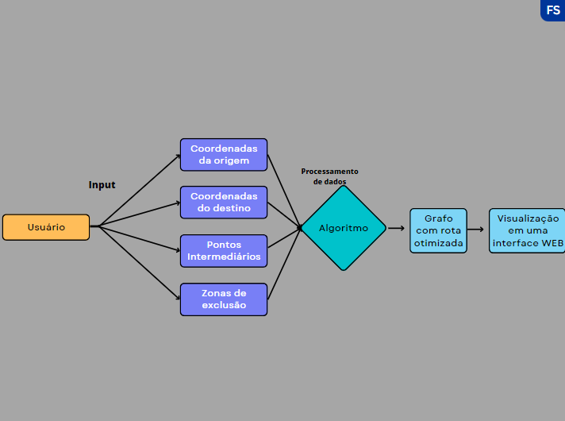
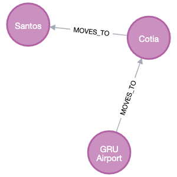
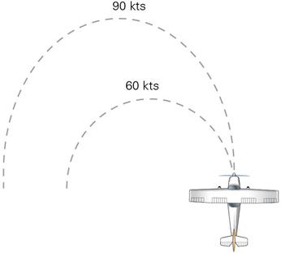
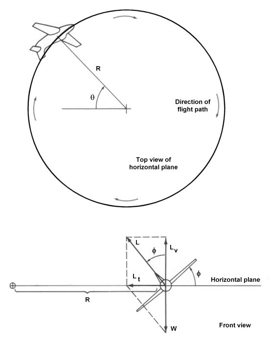
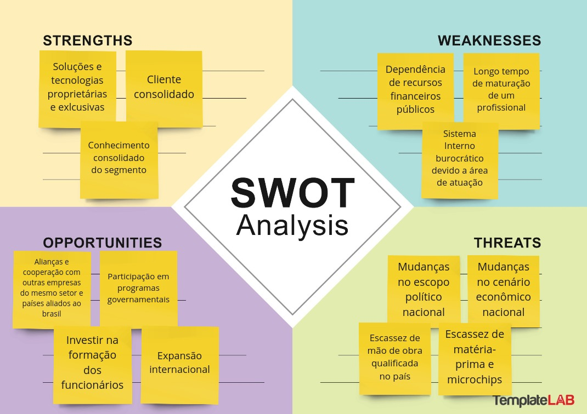
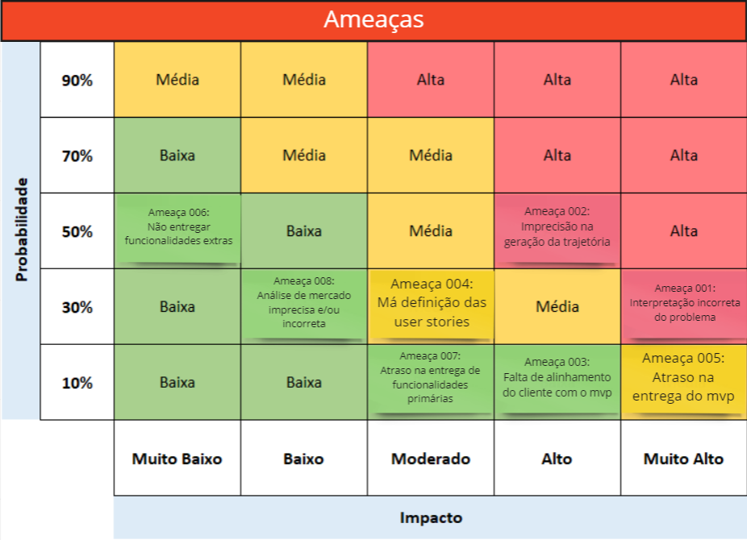
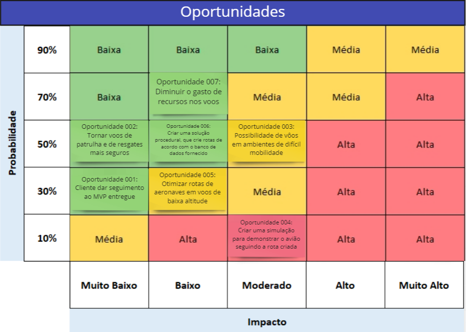
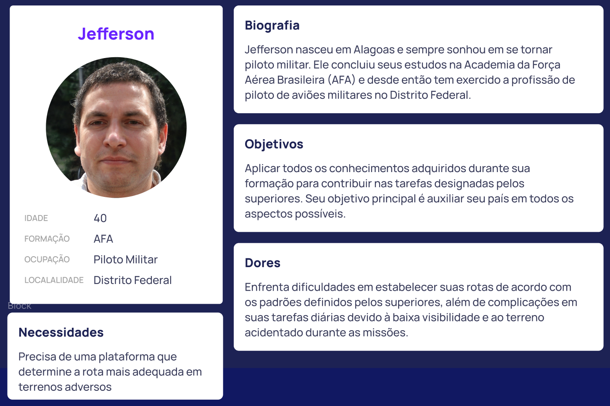
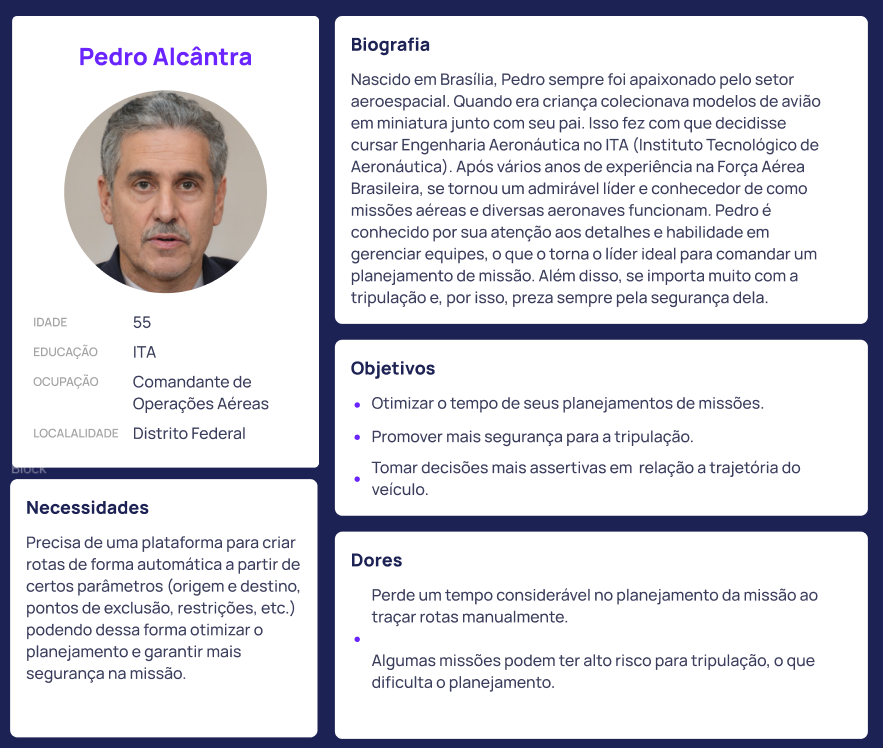
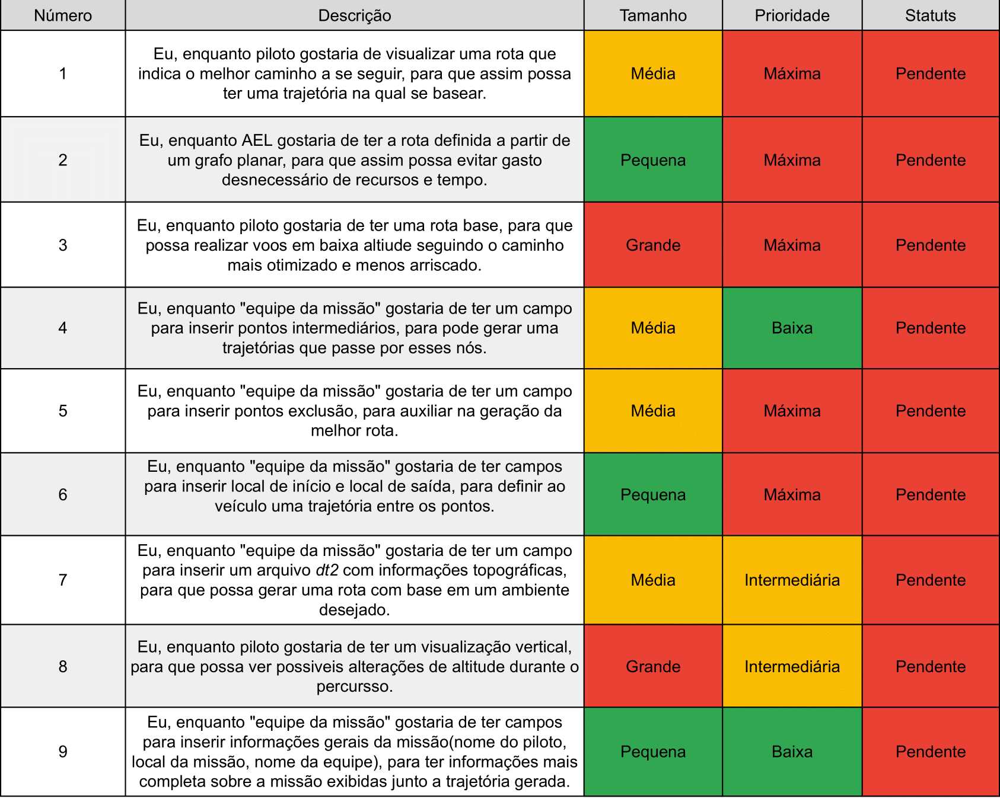

<table>
<tr>
<td>

</td>
<td>
</td>
</tr>
</table>

Planejador de trajetórias para voos em baixa altitude

**Conteúdo**

- [Autores](#autores)
- [Visão Geral do Projeto](#visão-geral-do-projeto)
  - [Empresa](#empresa)
  - [O Problema](#o-problema)
  - [Solução](#solução)
    - [Solução proposta](#solução-proposta)
    - [Como utilizar](#como-utilizar)
    - [Fluxograma (Arquitetura inicial)](#fluxograma-arquitetura-inicial)
    - [Modelagem Inicial do Problema](#modelagem-inicial-do-problema)
    - [Tomada de decisão](#tomada-de-decisão)
    - [Limitações existentes](#limitações-existentes)
      - [Zonas de exclusão](#zonas-de-exclusão)
      - [Máxima Razão de Curvatura Horizontal](#máxima-razão-de-curvatura-horizontal)
      - [Mínimo Raio de Curvatura](#mínimo-raio-de-curvatura)
    - [Modelagem Matemática do Problema](#modelagem-matemática-do-problema)
      - [Tomada de Decisão - Variáveis de Decisão](#tomada-de-decisão---variáveis-de-decisão)
      - [Objetivo - Função Objetivo](#objetivo---função-objetivo)
      - [Restrições - Limitações](#restrições---limitações)
    - [Benefícios](#benefícios)
    - [Critério de sucesso](#critério-de-sucesso)
  - [Objetivos](#objetivos)
    - [Objetivos gerais](#objetivos-gerais)
    - [Objetivos específicos](#objetivos-específicos)
  - [Partes interessadas](#partes-interessadas)
- [Análise do Problema](#análise-do-problema)
  - [Análise da área de atuação](#análise-da-área-de-atuação)
    - [Principais Players](#principais-players)
    - [Cinco Forças de Porter](#cinco-forças-de-porter)
      - [Rivalidade entre concorrentes](#rivalidade-entre-concorrentes)
      - [Poder de barganha dos fornecedores](#poder-de-barganha-dos-fornecedores)
      - [Poder de barganha dos compradores](#poder-de-barganha-dos-compradores)
      - [Ameaça de novos entrantes](#ameaça-de-novos-entrantes)
      - [Ameaça de produtos ou serviços substitutos](#ameaça-de-produtos-ou-serviços-substitutos)
    - [Tendências](#tendências)
    - [Modelo de Negócios](#modelo-de-negócios)
  - [Análise do cenário: Matriz SWOT](#análise-do-cenário-matriz-swot)
    - [Forças](#forças)
    - [Fraquezas](#fraquezas)
    - [Oportunidades](#oportunidades)
    - [Ameaças](#ameaças)
  - [Proposta de Valor: Value Proposition Canvas](#proposta-de-valor-value-proposition-canvas)
  - [Matriz de Risco](#matriz-de-risco)
- [Requisitos do Sistema](#requisitos-do-sistema)
  - [Personas](#personas)
  - [Histórias dos usuários (user stories)](#histórias-dos-usuários-user-stories)
- [Arquitetura do Sistema](#arquitetura-do-sistema)
  - [Módulos do Sistema e Visão Geral (Big Picture)](#módulos-do-sistema-e-visão-geral-big-picture)
  - [Descrição dos Subsistemas](#descrição-dos-subsistemas)
    - [Requisitos de software](#requisitos-de-software)
  - [Tecnologias Utilizadas](#tecnologias-utilizadas)
- [UX e UI Design](#ux-e-ui-design)
  - [Wireframe + Storyboard](#wireframe--storyboard)
  - [Design de Interface - Guia de Estilos](#design-de-interface---guia-de-estilos)
- [Projeto de Banco de Dados](#projeto-de-banco-de-dados)
  - [Modelo Conceitual](#modelo-conceitual)
  - [Modelo Lógico](#modelo-lógico)
- [Teste de Software](#teste-de-software)
  - [Testes Unitários](#testes-unitários)
  - [Teste de Usabilidade](#teste-de-usabilidade)
- [Análise de Dados](#análise-de-dados)
- [Manuais](#manuais)
  - [Manual de Implantação](#manual-de-implantação)
  - [Manual do Usuário](#manual-do-usuário)
  - [Manual do Administrador](#manual-do-administrador)
- [Referências](#referências)

# Autores

* Felipe Sampaio Silva
* Frederico Schur
* Gabriel Elias Carneiro
* Gábrio Lina da Silva
* Iago Medeiros Tavares
* Renato Silva Machado
* Vitor Augusto Menten de Barros

# Visão Geral do Projeto

## Empresa

A AEL Sistemas é uma empresa brasileira, parte do grupo Elbit Systems, situada em Porto Alegre que dedica-se ao projeto, desenvolvimento, fabricação, manutenção e suporte logístico de sistemas eletrônicos militares e espaciais, para aplicações em plataformas aéreas, marítimas e terrestres. Capacitada para o fornecimento, projeto e desenvolvimento de aviônicos, sistemas terrestres e sistemas para segurança pública, a empresa também participa de diversos programas da indústria espacial. Sua missão é viabilizar soluções confiáveis e inovadoras que ampliem as capacidades dos clientes, com foco nos segmentos Aeroespacial, Defesa e Segurança. Software e sistemas são o foco de produção do time de desenvolvimento, com investimentos constantes na capacitação de pessoas e em profissionais altamente qualificados. Seus principais valores são: Foco no Cliente, Competência, Flexibilidade, Inovação e Excelência, Valorização das Pessoas e Sustentabilidade, Credibilidade e Respeito.

## O Problema

Diversas aplicações dentro da indústria de aviação, como busca e salvamento, por exemplo, se beneficiam de realizar voos a baixa altitude. No entanto, em decorrência da proximidade com o solo esse tipo de operação representa um risco iminente de colisão com o solo. Tendo em vista essa problemática, a AEL Sistemas desenvolve sistemas de Terrain Following embarcados em plataformas aéreas com foco em sistemas críticos de missão.

Sistemas de Terrain Following são utilizados para auxiliar esse tipo de missão provendo uma guiagem ao piloto, orientando ele como conduzir a aeronave de forma segura nesse ambiente desafiador a partir de dados obtidos do voo. 

O problema que a solução pretende resolver está relacionado à otimização do trajeto de voos de baixa altitude considerando os riscos de colisão com o solo e fatores que possam afetar a missão. Atualmente, as trajetórias de voo construídas são levadas a evitar áreas mais povoadas pela maior probabilidade de ter sistemas de monitoramento. Diante disso, ao traçar a trajetória, áreas com feições geográficas elevadas como morros, vales e cadeias de montanhas, que minimizam ainda mais a probabilidade de detecção, tendem a ser mais escolhidas, o que gera uma necessidade ainda maior de controle da rota para a segurança dos tripulantes. 

## Solução

### Solução proposta

A solução consiste em um software desenvolvido em Java capaz de receber como entradas os dados da região geográfica de operação, o banco de dados de elevação, as zonas de exclusão (restrições) e o ponto de partida e de destino. Inicialmente, será possível acessá-la por meio de um terminal (por exemplo: aplicação.java 'apollo' 123 321). E como saída será gerada uma série de nós que conectam os pontos de partida e de destino respeitando as restrições impostas na especificação do usuário.

A partir da coleta das informações do voo, é construída a trajetória de referência, que traça um caminho que tem como partida o ponto de início da operação em baixa altitude, e como destino o ponto de retorno a território seguro onde o voo a baixa altitude pode ser finalizado com segurança. 

Os dados que serão utilizados para auxílio da construção do algoritmo são referentes à elevação do solo das seguintes regiões: Yosemite, Death Valley, Rio e São Paulo. Para a leitura do banco de dados dos terrenos, uma biblioteca open source (Java) será utilizada. 

Na visualização do banco de dados do terreno, será utilizado o software GIS, que é um sistema que conecta dados a um mapa, integrando dados de localização, onde as coisas estão, com todos os tipos de informações descritivas, ou seja, como as coisas são lá.

### Como utilizar

A solução proposta será aplicada de forma para determinar a rota mais adequada levando em conta os fatores presentes na área de voo. Ela se fundamenta em informações geográficas relacionadas ao terreno, bem como no desempenho das aeronaves e outros aspectos operacionais, visando minimizar os riscos. O principal usuário da solução poderá incluir parâmetros de software, resultando em uma visualização da rota de voo.

### Fluxograma (Arquitetura inicial)

### Modelagem Inicial do Problema
A priori, identificamos uma modelagem que consiste na criação de um nó para cada localização. Utilizamos o [Neo4J](https://neo4j.com/) — um banco de dados orientado a grafos — para realizar a modelagem: 

Cada nó possuem propriedades específicas, são elas:  
  - Id: Inteiro, Identificação única
  - Nome 
  - Altitude média
  - Latitude e Longitude

E cada relação ("MOVES_TO") também possui propriedades próprias:
  - Distância em quilômetros
  - Diferença de altitude em metros (Caso esse "range" seja negativo, há uma descida entre um ponto e outro; caso não há uma subida)

### Tomada de decisão

Buscando-se obter o caminho mais otimizado, será priorizada, pelo algoritmo, a rota que suprir os requisitos e parâmetros de entrada, devendo esta, não atingir pontos de exclusão, respeitar os limites de vôo da aeronave, como velocidade máxima, raio de curvatura e outros, além de buscar diminuir o consumo de combustível e distância entre o ponto inicial e final, passando por localizações pré-definidas, caso estas sejam especificadas.

### Limitações existentes

Durante o processo de desenvolvimento de uma trajetória, a solução deve considerar diversos fatores, a fim de prover a rota desejada. Entre estes, encontram-se como fatores limitantes: zonas de exclusão, máxima razão de curvatura horizontal, e raio mínimo de curvatura, além da velocidade máxima.

#### Zonas de exclusão
Definem-se como zonas de exclusão os seguintes elementos:
- Raio de alcance de radares
- Áreas de vigilância constante
- Outras zonas não desejadas

#### Máxima Razão de Curvatura Horizontal
- Ângulo máximo de curva por segundo
- 

#### Mínimo Raio de Curvatura
- Define o raio mínimo em que uma aeronave pode se curvar
- 

### Modelagem Matemática do Problema

OBS: A solução final terá mais pontos do que descrito abaixo. A modelagem foi feita a partir do grafo mencionado anteriormente que representa uma ideia inicial.

#### Tomada de Decisão - Variáveis de Decisão
A tomada de decisão do problema consiste em um verdadeiro ou falso - verdadeiro (1) se passou pelo caminho e falso (0) se não passou pelo caminho.

xij {1 - se usar o caminho; 0 caso contrário

i - nó de origem  
j - nó de destino

#### Objetivo - Função Objetivo

O objetivo é minimizar o caminho percorrido de acordo com os pesos das arestas. Dessa forma, a função objetivo consiste na soma dos pesos vezes o valor da tomada de decisão (0 ou 1). Ou seja, apenas os caminhos usados realmente afetarão a função, já que aqueles que não forem usados serão multiplicados por 0.

Min C = var_0.xP 1 + var_1.x1 2 + var_27.x12 1 + var_15.x2 14 + var_2.x2 3 + var_17.x5 15 + var_3.x3 4 + var_4.x4 5 + var_5.x5 6 + var_6.x6 7 + var_23.x7 19 + var_7.x7 8 + var_8.x8 9 + var_14.x8 11 + var_13.x8 10 + var_9.x10 12 + var_25.x12 20 + var_12.x12 I + var_16.x14 3 + var_19.x15 16 + var_20.x16 17 + var_21.x17 18 + var_22.x18 7

#### Restrições - Limitações
As restrições consistem em que tudo que entra é igual ao que sai. No caso do nó "Petrópolis" (nó P) 1 será igual a tomada de decisão pois alguma aresta será utilizada obrigatoriamente e no caso do nó "Itaipava" (nó I) as tomadas de decisão serão iguais a 1 pois sempre chegará nele por uma aresta obrigatoriamente. 

Nó P: 1 = xP 1 
Nó 1: xP 1 = x12 1 + x1 2 
Nó 2: x1 2 = x21 4 + x2 3 
Nó 3: x2 3 + x14 3 = x3 15 + x3 4 
Nó 4: x3 4 + x15 4 = x4 5 
Nó 5: x4 5 = x5 6 
Nó 6: x5 6 = x6 7 
Nó 7: x6 7 + x18 7 = x7 18 + x7 8 
Nó 8: x7 8 + x19 8 = x8 9 + x8 10 + x8 11 
Nó 9: x8 9 = 0 
Nó 10: x8 10 = x10 12 
Nó 11: x8 11 = 0  
Nó 12: x10 12 = x12 20 + x12 I 
Nó 14: x2 14 = x14 3 
Nó 15: x3 15 = x15 16 + x15 4 
Nó 16: x15 16 = x16 17 
Nó 17: x16 17 = x17 18 
Nó 18: x17 18 = x18 7 
Nó 19: x7 19 = x19 8  
Nó 20: x12 20 = x20 I 
Nó 21: x1 21 = 0 
Nó I: x12 I + x20 I = 1 
xij E {0, 1}

### Benefícios

A proposta da solução oferece vários benefícios, incluindo uma visão completa do terreno e da rota, melhoria do consumo de combustível, redução de custos, economia de recursos e otimização do tempo na elaboração das rotas. Todos esses benefícios visam garantir a segurança do piloto.

### Critério de sucesso

Um dos critérios de sucesso será o tempo de execução do programa (visualização e criação da rota). Para avaliá-lo será considerado como adequado um tempo menor do que um minuto para a visualização e um tempo menor ou igual para o desempenho do algoritmo. Outro critério será a criação de um grafo direcionado com início no ponto de origem e fim no ponto de destino (grafo acíclico). Isso será avaliado a partir da análise do grafo gerado na visualização final.

## Objetivos

### Objetivos gerais

O objetivo geral do projeto é desenvolver um algoritmo que servirá de base para eventuais projetos que englobam, além da plataforma embarcada, sistemas de planejamento de missões em solo.

### Objetivos específicos

- Desenvolvimento de componente que gera um grafo a partir do banco de dados de elevação;
- Remoção de arestas que violam restrições impostas pelo parceiro;
- Algoritmo de busca de uma trajetória ótima considerando diversas variáveis, e minimizando ao máximo a altitude;
- Desenvolvimento de software para visualização do trajeto; 

## Partes interessadas

Os interessados da AEL Sistemas (parceiro direto do projeto) são:
- LÍDER DO PROJETO: Conrado Pilotto
- LÍDER TÉCNICO: Norton Lima Barbieri

Possíveis interessados são os clientes da AEL (como o governo) e as equipes destes clientes, que utilizarão efetivamente a solução do projeto.

# Análise do Problema

## Análise da área de atuação

### Principais Players

Os principais players globais do setor de
fabricação de componentes de aviação e aeroespaciais e de defesa são:  
1. Lockheed Martin - É a maior empresa de armamentos do mundo, atuando também no setor aeroespacial e de aviação. Na área de Defesa, uma de suas especialidades são os caças e aviões militares.
2. BAE Systems - É a segunda maior empresa do mundo no setor de Defesa, além de atuar também em aviação, tecnologia aeroespacial e segurança. Seus principais projetos envolvem a produção de caças.
3. Boeing - Apesar de ser mais conhecida pela aviação comercial, também atua no desenvolvimento de caças, aviões militares, sistemas eletrônicos, mísseis e tecnologia aeroespacial.
4. Northrop Grumman - É a quarta maior empresa do setor. A empresa vem apostando na área de drones para missões de espionagem e ataque.
5. Elbit Systems - É uma empresa internacional de alta tecnologia engajada nas áreas de defesa e segurança nacional. Desenvolvem e fornecem sistemas e produtos aerotransportados, terrestres e navais para defesa, segurança interna e aplicações comerciais. Além disso, fornecem uma gama de serviços de treinamento e suporte.

Os principais players brasileiros, além da AEL são:
1. Helibras - Única fabricante de helicópteros do Brasil, a Helibras pertence ao grupo europeu EADS. A empresa produz tanto modelos civis quanto militares.
2. Embraer - Desenvolve e opera sistemas de comunicação, computação, comando, controle e inteligência.
3. Avibras - Dedica-se ao projeto e fabricação de mísseis e sistemas de defesa ar-terra e terra-terra, além de aviões não tripulados. Desenvolve tecnologia nas áreas de aeronáutica, espaço, eletrônica, veicular e defesa.
4. Atech - empresa especializada no desenvolvimento de soluções de missões críticas, como sistemas de comando e controle, segurança cibernética, sistemas embarcados, simuladores, sistemas de instrumentação e controle e treinamento.
5. Omnisys Engenharia - Presta serviços em sistemas para aplicações aeronáuticas e navais e soluções para as áreas espacial, de telecomunicações e atividades industriais, soluções de guerra eletrônica e software embarcado.

### Cinco Forças de Porter

#### Rivalidade entre concorrentes
As empresas do setor, no geral, desenvolvem produtos e serviços parecidos entre si. Dessa forma, a concorrência entre elas aumenta, já que suas atuações são semelhantes. Assim, as empresas devem focar na inovação para se diferenciarem nesse ambiente rivalizado.

#### Poder de barganha dos fornecedores

A AEL Sistemas fabrica componentes de aviação e aeroespaciais. Dessa forma, fornecedores de elementos eletrônicos para essas soluções podem ter um poder de barganha maior, já que alguns desses elementos, como microprocessadores, são escassos no mercado (crise de matéria-prima para esses componentes) e com poucos fornecedores. Além disso, a restrição de fornecedores por parte dos clientes também contribuem para um poder de barganha menor. Assim, a AEL não teria muitas opções além de aceitar os termos de seus fornecedores.

#### Poder de barganha dos compradores

A AEL Sistemas tem uma grande ligação com projetos das Forças Armadas Brasileiras há alguns anos. Nesse caso, a AEL teria um poder de barganha maior pela confiança e pela parceria. Contudo, em um cenário global, a grande quantidade de players pode fazer com que o poder de barganha dos compradores aumente por ter mais opções de mercado.

#### Ameaça de novos entrantes

O setor da AEL já é consolidado e com uma grande concorrência entre seus players. Assim, a ameaça de novos entrantes não é tão alta, já que as maiores empresas do setor têm a confiança do mercado e se dedicam constantemente para a inovação na área. Além disso, a boa relação entre a AEL e as Forças Armadas faz com que novos entrantes no Brasil tenham dificuldade em ameaçar a atual posição.

#### Ameaça de produtos ou serviços substitutos

O setor de fabricação de componentes de aviação e aeroespaciais e de defesa é um setor com produtos e serviços para finalidades específicas. Dessa forma, produtos ou serviços substitutos tendem a não ameaçar as empresas já estabelecidas do setor. No caso da AEL, que possui uma grande variedade de produtos e serviços, sua participação no setor pode não ser tão ameaçada. Haveria apenas uma concorrência com produtos semelhantes.

### Tendências

As principais tendências do setor aeroespacial e de defesa são:
- Reduzir custos de voo e emissões por meio de motores elétricos e híbridos. O cuidado com o meio ambiente tornou-se a principal questão para as empresas com um propósito, isso significa produzir motores que consumam menos combustíveis.
- Sistemas de voo autônomos. De drones a veículos, sistemas de aviação que exigem alto grau de automação.
- Ciclos de manutenção baseado em dados simulados para evitar problemas de funcionamento minimizando os custos de reparo associados.
- Fabricação de peças aditivas (produzidas a partir de um modelo digital) e consolidadas. Tendência na fabricação de peças, que reduzirão custos e tempo de montagem.
- Solução de simulação multifísica. Melhorar a previsão de reação aos sistemas de aeronaves no mundo real, principalmente minimizar riscos.

### Modelo de Negócios

A AEL Sistemas se dedica ao projeto, desenvolvimento, fabricação, manutenção e suporte logístico de avançados sistemas eletrônicos militares e espaciais, com foco nos segmentos Aeroespacial, Defesa e Segurança. Ela gera receita principalmente na venda direta de seus produtos e serviços para outras empresas, como a SAAB, Embraer e Helibras, e para as áreas do exército brasileiro (marinha, forças armadas e força aérea). Ou seja, ela não possui um distribuidor, ela vende suas soluções diretamente para seus clientes. Quando a empresa enxerga que suas soluções já existentes não são tão robustas para certo problema, ela tende a colaborar com possíveis concorrentes para desenvolver um produto mais assertivo.

## Análise do cenário: Matriz SWOT

### Forças
- Cadeia de fornecimento global para matéria-prima
- Soluções e tecnologias proprietárias e exlcusivas
- Conhecimento consolidado do segmento
- Cliente consolidado
### Fraquezas
- Dependência de recursos financeiros públicos
- Sistema Interno burocrático devido a área de atuação
- Longo tempo de maturação de um profissional
### Oportunidades
- Alianças e cooperação com outras empresas do mesmo setor e países aliados ao brasil
- Participação em programas governamentais
- Expansão internacional
- Investir na formação dos funcionários
- Alta Barreira para novos entrantes
### Ameaças
- Mudanças no escopo político nacional
- Mudanças no cenário econômico nacional
- Escassez de matéria-prima e microchips
- Escassez de mão de obra qualificada no país

## Proposta de Valor: Value Proposition Canvas

## Matriz de Risco

# Requisitos do Sistema

*Descrição_dos_requisitos*

## Personas

## Histórias dos usuários (user stories)

# Arquitetura do Sistema

## Módulos do Sistema e Visão Geral (Big Picture)

## Descrição dos Subsistemas

### Requisitos de software

## Tecnologias Utilizadas

# UX e UI Design

## Wireframe + Storyboard

## Design de Interface - Guia de Estilos

# Projeto de Banco de Dados

## Modelo Conceitual

## Modelo Lógico

# Teste de Software

## Testes Unitários

## Teste de Usabilidade

# Análise de Dados

# Manuais

## Manual de Implantação

## Manual do Usuário

## Manual do Administrador

# Referências
