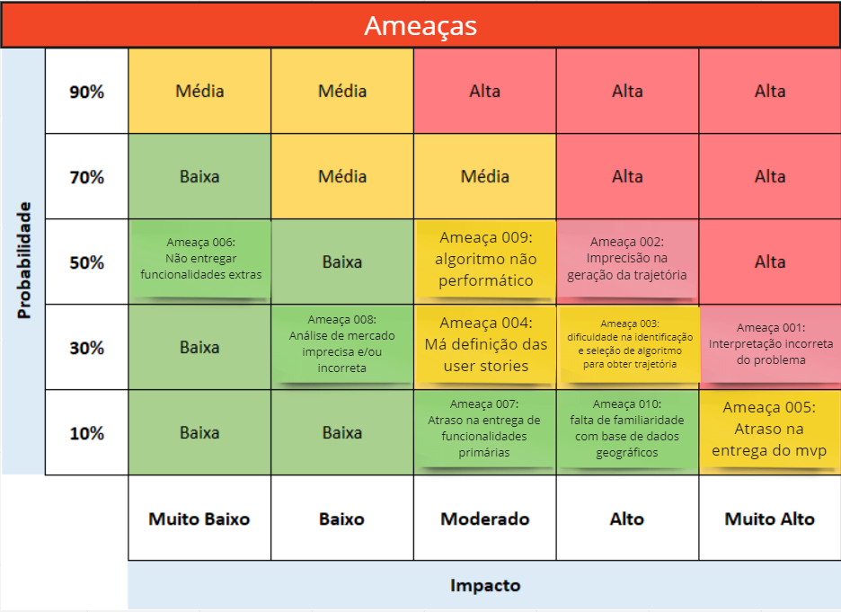
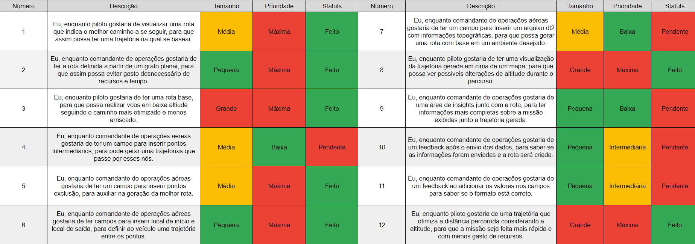

<table>
<tr>
<td>
<a href= "https://ael.com.br/"></a>
</td>
<td><a href= "https://www.inteli.edu.br/"></a>
</td>
</tr>
</table>

<font size="+12"><center>
Planejador de trajetórias para voos em baixa altitude
</center></font>

**Conteúdo**

- [Autores](#autores)
- [Visão Geral do Projeto](#visão-geral-do-projeto)
  - [Empresa](#empresa)
  - [O Problema](#o-problema)
  - [Solução](#solução)
    - [Solução proposta](#solução-proposta)
    - [Como utilizar](#como-utilizar)
    - [Fluxograma (Arquitetura inicial)](#fluxograma-arquitetura-inicial)
    - [Modelagem Inicial do Problema](#modelagem-inicial-do-problema)
    - [Tomada de decisão](#tomada-de-decisão)
    - [Limitações existentes](#limitações-existentes)
      - [Zonas de exclusão](#zonas-de-exclusão)
      - [Máxima Razão de Curvatura Horizontal](#máxima-razão-de-curvatura-horizontal)
      - [Mínimo Raio de Curvatura](#mínimo-raio-de-curvatura)
    - [Modelagem Matemática do Problema](#modelagem-matemática-do-problema)
      - [Tomada de Decisão - Variáveis de Decisão](#tomada-de-decisão---variáveis-de-decisão)
      - [Objetivo - Função Objetivo](#objetivo---função-objetivo)
      - [Restrições - Limitações](#restrições---limitações)
    - [Benefícios](#benefícios)
    - [Critério de sucesso](#critério-de-sucesso)
  - [Objetivos](#objetivos)
    - [Objetivos gerais](#objetivos-gerais)
    - [Objetivos específicos](#objetivos-específicos)
  - [Partes interessadas](#partes-interessadas)
- [Análise do Problema](#análise-do-problema)
  - [Análise da área de atuação](#análise-da-área-de-atuação)
    - [Principais Players](#principais-players)
    - [Cinco Forças de Porter](#cinco-forças-de-porter)
      - [Rivalidade entre concorrentes](#rivalidade-entre-concorrentes)
      - [Poder de barganha dos fornecedores](#poder-de-barganha-dos-fornecedores)
      - [Poder de barganha dos compradores](#poder-de-barganha-dos-compradores)
      - [Ameaça de novos entrantes](#ameaça-de-novos-entrantes)
      - [Ameaça de produtos ou serviços substitutos](#ameaça-de-produtos-ou-serviços-substitutos)
    - [Tendências](#tendências)
    - [Modelo de Negócios](#modelo-de-negócios)
  - [Análise do cenário: Matriz SWOT](#análise-do-cenário-matriz-swot)
    - [Forças](#forças)
    - [Fraquezas](#fraquezas)
    - [Oportunidades](#oportunidades)
    - [Ameaças](#ameaças)
  - [Proposta de Valor: Value Proposition Canvas](#proposta-de-valor-value-proposition-canvas)
  - [Matriz de Risco](#matriz-de-risco)
- [Requisitos do Sistema](#requisitos-do-sistema)
  - [Personas](#personas)
  - [Histórias dos usuários (user stories)](#histórias-dos-usuários-user-stories)
- [Arquitetura do Sistema](#arquitetura-do-sistema)
  - [Módulos do Sistema e Visão Geral (Big Picture)](#módulos-do-sistema-e-visão-geral-big-picture)
  - [Descrição dos Subsistemas](#descrição-dos-subsistemas)
    - [Requisitos de software](#requisitos-de-software)
  - [Tecnologias Utilizadas](#tecnologias-utilizadas)
- [UX e UI Design](#ux-e-ui-design)
  - [Wireframe + Storyboard](#wireframe--storyboard)
  - [Design de Interface - Guia de Estilos](#design-de-interface---guia-de-estilos)
- [Projeto de Banco de Dados](#projeto-de-banco-de-dados)
  - [Modelo Conceitual](#modelo-conceitual)
  - [Modelo Lógico](#modelo-lógico)
- [Teste de Software](#teste-de-software)
  - [Testes de Integração - Neo4J](#testes-de-integração---neo4j)
  - [Teste Backend](#teste-backend)
  - [Teste Frontend](#teste-frontend)
  - [Testes Unitários](#testes-unitários)
    - [CoordinateVertex](#coordinatevertex)
    - [CoordinateEdge](#coordinateedge)
    - [Graph](#graph)
    - [Haversine](#haversine)
  - [Teste de Usabilidade](#teste-de-usabilidade)
- [Complexidade e Corretude do Algoritmo](#complexidade-e-corretude-do-algoritmo)
  - [Pior caso](#pior-caso)
  - [Melhor caso](#melhor-caso)
  - [Observação](#observação)
  - [Corretude do Algoritmo](#corretude-do-algoritmo)
    - [Invariante do laço](#invariante-do-laço)
- [Análise de Dados](#análise-de-dados)
- [Manuais](#manuais)
  - [Manual de Implantação](#manual-de-implantação)
  - [Manual do Usuário](#manual-do-usuário)
  - [Manual do Administrador](#manual-do-administrador)
- [Referências](#referências)


# Autores

* Felipe Sampaio Silva
* Frederico Schur
* Gabriel Elias Carneiro
* Gábrio Lina da Silva
* Iago Medeiros Tavares
* Renato Silva Machado
* Vitor Augusto Menten de Barros


# Visão Geral do Projeto

## Empresa

A AEL Sistemas é uma empresa brasileira, parte do grupo Elbit Systems, situada em Porto Alegre que dedica-se ao projeto, desenvolvimento, fabricação, manutenção e suporte logístico de sistemas eletrônicos militares e espaciais, para aplicações em plataformas aéreas, marítimas e terrestres. Capacitada para o fornecimento, projeto e desenvolvimento de aviônicos, sistemas terrestres e sistemas para segurança pública, a empresa também participa de diversos programas da indústria espacial. Sua missão é viabilizar soluções confiáveis e inovadoras que ampliem as capacidades dos clientes, com foco nos segmentos Aeroespacial, Defesa e Segurança. Software e sistemas são o foco de produção do time de desenvolvimento, com investimentos constantes na capacitação de pessoas e em profissionais altamente qualificados. Seus principais valores são: Foco no Cliente, Competência, Flexibilidade, Inovação e Excelência, Valorização das Pessoas e Sustentabilidade, Credibilidade e Respeito.


## O Problema

Diversas aplicações dentro da indústria de aviação, como busca e salvamento, por exemplo, se beneficiam de realizar voos a baixa altitude. No entanto, em decorrência da proximidade com o solo esse tipo de operação representa um risco iminente de colisão com o solo. Tendo em vista essa problemática, a AEL Sistemas desenvolve sistemas de Terrain Following embarcados em plataformas aéreas com foco em sistemas críticos de missão.

Sistemas de Terrain Following são utilizados para auxiliar esse tipo de missão provendo uma guiagem ao piloto, orientando ele como conduzir a aeronave de forma segura nesse ambiente desafiador a partir de dados obtidos do voo. 

O problema que a solução pretende resolver está relacionado à otimização do trajeto de voos de baixa altitude considerando os riscos de colisão com o solo e fatores que possam afetar a missão. Atualmente, as trajetórias de voo construídas são levadas a evitar áreas mais povoadas pela maior probabilidade de ter sistemas de monitoramento. Diante disso, ao traçar a trajetória, áreas com feições geográficas elevadas como morros, vales e cadeias de montanhas, que minimizam ainda mais a probabilidade de detecção, tendem a ser mais escolhidas, o que gera uma necessidade ainda maior de controle da rota para a segurança dos tripulantes. 

## Solução

### Solução proposta

A solução consiste em um software desenvolvido em Java capaz de receber como entradas os dados da região geográfica de operação, o banco de dados de elevação, as zonas de exclusão (restrições) e o ponto de partida e de destino. Inicialmente, será possível acessá-la por meio de um terminal (por exemplo: aplicação.java 'apollo' 123 321). E como saída será gerada uma série de nós que conectam os pontos de partida e de destino respeitando as restrições impostas na especificação do usuário.

A partir da coleta das informações do voo, é construída a trajetória de referência, que traça um caminho que tem como partida o ponto de início da operação em baixa altitude, e como destino o ponto de retorno a território seguro onde o voo a baixa altitude pode ser finalizado com segurança. 

Os dados que serão utilizados para auxílio da construção do algoritmo são referentes à elevação do solo das seguintes regiões: Yosemite, Death Valley, Rio e São Paulo. Para a leitura do banco de dados dos terrenos, uma biblioteca open source (Java) será utilizada. 

Na visualização do banco de dados do terreno, será utilizado o software GIS, que é um sistema que conecta dados a um mapa, integrando dados de localização, onde as coisas estão, com todos os tipos de informações descritivas, ou seja, como as coisas são lá.

### Como utilizar

A solução proposta será aplicada de forma para determinar a rota mais adequada levando em conta os fatores presentes na área de voo. Ela se fundamenta em informações geográficas relacionadas ao terreno, bem como no desempenho das aeronaves e outros aspectos operacionais, visando minimizar os riscos. O principal usuário da solução poderá incluir parâmetros de software, resultando em uma visualização da rota de voo.

### Fluxograma (Arquitetura inicial)


### Modelagem Inicial do Problema

Com o objetivo de representar o problema de uma forma quantitativamente eficiente, foram utilizados grafos. A visualização do problema em um grafo pode ser feita utilizando o banco de dados [Neo4J](https://neo4j.com/), com o código abaixo como exemplo: 

```cypher
Create(r0:Petrópolis{nome:"Petrópolis",coord:"-22.507371108532418, -43.18604972500784",elev_m:2})
Create(r1:Region1{nome:"1",coord:"-22.49990803773384, -43.17923091529861",elev_m:17})
Create(r2:Region2{nome:"2",coord:"-22.499393230127055, -43.1686337408087",elev_m:3})
Create(r3:Region3{nome:"3",coord:"-22.499710420013947, -43.1686337408087",elev_m:150})
Create(r4:Region4{nome:" 4",coord:"-22.491304642288366, -43.1633122381705",elev_m:80})
Create(r5:Region5{nome:"5",coord:"-22.479567419238222, -43.15524415352548",elev_m:11})
Create(r6:Region6{nome:"6",coord:"-22.473698434555835, -43.18133668259022",elev_m:11})
Create(r7:Region7{nome:"7",coord:"-22.4512395961453, -43.16832775918275",elev_m:7})
Create(r8:Region8{nome:"8",coord:"-22.426902150943395, -43.13980242471486",elev_m:116})
Create(r9:Region9{nome:"9",coord:"-22.4273078100088, -43.14024127601437",elev_m:5})
Create(r10:Region10{nome:"10",coord:"-22.435420742362048, -43.10996053634845",elev_m:60})
Create(r11:Region11{nome:"11",coord:"-22.40621196717168, -43.1784213390714",elev_m:8})
Create(r12:Region12{nome:"12",coord:"-22.399314554487333, -43.14857945070498",elev_m:130})
Create(r13:Region13{nome:"Itaipava",coord:"-22.383489785287257, -43.13453620912079",elev_m:9})

Create(r14:Region14{nome:"14",coord:"-22.500738057367546, -43.18531385801286",elev_m:12})
Create(r15:Region15{nome:"15",coord:"-22.49843672013675, -43.18485257244116",elev_m:25})
Create(r16:Region16{nome:"16",coord:"-22.484201672569323, -43.18365322995473",elev_m:19})
Create(r17:Region17{nome:"17",coord:"-22.471277687477787, -43.178179768549334",elev_m:29})
Create(r18:Region18{nome:"18",coord:"-22.4962041789774867, -43.16860095351757",elev_m:9})
Create(r19:Region19{nome:"19",coord:"-22.48536712547217, -43.163713802991154",elev_m:98})
Create(r20:Region20{nome:"20",coord:"-22.482296472705713, -43.1586311664437",elev_m:109})
Create(r21:Region21{nome:"21",coord:"-22.474256762705713, -43.1586311664437",elev_m:90})


Create(r0)-[:var_0]->(r1)
Create(r1)-[:var_1]->(r2)
Create(r2)-[:var_2]->(r3)
Create(r3)-[:var_3]->(r4)
Create(r4)-[:var_4]->(r5)
Create(r5)-[:var_5]->(r6)
Create(r6)-[:var_6]->(r7)
Create(r7)-[:var_7]->(r8)
Create(r8)-[:var_8]->(r9)
Create(r10)-[:var_9]->(r12)
Create(r12)-[:var_12]->(r13)
Create(r8)-[:var_13]->(r10)
Create(r8)-[:var_14]->(r11)
Create (r2)-[:var_15]->(r14)
Create (r14)-[:var_16]->(r3)
Create (r3)-[:var_17]->(r15)
Create(r15)-[:var_18]->(r4)
Create(r15)-[:var_19]->(r16)
Create(r16)-[:var_20]->(r17)
Create(r17)-[:var_21]->(r18)
Create(r18)-[:var_22]->(r7)
Create(r7)-[:var_23]->(r19)
Create(r19)-[:var_24]->(r8)
Create(r12)-[:var_25]->(r20)
Create(r20)-[:var_26]->(r13)
Create(r1)-[:var_27]->(r21)

Return r0,r1,r2,r3,r4,r5,r6,r7,r8,r9,r10, r11, r12, r13, r14, r15, r16, r17, r18, r19, r20, r21
```


Neste caso, o ponto de partida seria Petrópolis e o de destino Itaipava, evidenciados na cor amarela. No grafo, existem rotas impossíveis destacadas em vermelho, seja pela presença de um radar inimigo ou uma circunstância que impossibilite/dificulte a passagem naquela região. Também há rotas possíveis, porém não otimizadas, como as regiões pintadas em cinza, seja por algum motivo relacionado à irregularidade na topografia local ou maior distância para alcançar o destino final. A solução proposta utiliza um algoritmo que encontra a rota mais eficiente entre o ponto de destino e origem, que passa pelas regiões destacadas em verde.

 É importante destacar as variações de cores das arestas, que representam o range entre os nós no mapa. Na representação apresentada, a cor laranja indica um aclive entre um ponto e outro do terreno, a cor azul indica um declive, e as arestas em cinza representam altitudes iguais. A espessura das arestas indica o caminho sugerido a ser seguido. Quanto mais espessa a aresta, mais recomendado é seguir esse caminho, pois é a rota mais otimizada. As arestas contêm informações sobre a distância entre as regiões demarcadas e a diferença de altitude entre elas, que são usadas para realizar ponderações e determinar a rota mais otimizada para a missão.

 


### Tomada de decisão

Buscando-se obter o caminho mais otimizado, será priorizada, pelo algoritmo, a rota que suprir os requisitos e parâmetros de entrada, devendo esta, não atingir pontos de exclusão, respeitar os limites de vôo da aeronave, como velocidade máxima, raio de curvatura e outros, além de buscar diminuir o consumo de combustível e distância entre o ponto inicial e final, passando por localizações pré-definidas, caso estas sejam especificadas.

### Limitações existentes

Durante o processo de desenvolvimento de uma trajetória, a solução deve considerar diversos fatores, a fim de prover a rota desejada. Entre estes, encontram-se como fatores limitantes: zonas de exclusão, máxima razão de curvatura horizontal, e raio mínimo de curvatura, além da velocidade máxima.

#### Zonas de exclusão
Definem-se como zonas de exclusão os seguintes elementos:
- Raio de alcance de radares
- Áreas de vigilância constante
- Outras zonas não desejadas

#### Máxima Razão de Curvatura Horizontal
- Ângulo máximo de curva por segundo
- 

#### Mínimo Raio de Curvatura
- Define o raio mínimo em que uma aeronave pode se curvar
- 


### Modelagem Matemática do Problema

OBS: A solução final terá mais pontos do que descrito abaixo. A modelagem foi feita a partir do grafo mencionado anteriormente que representa uma ideia inicial.

#### Tomada de Decisão - Variáveis de Decisão
A tomada de decisão do problema consiste em um verdadeiro ou falso - verdadeiro (1) se passou pelo caminho e falso (0) se não passou pelo caminho.

x<sub>ij</sub> {1 - se usar o caminho; 0 caso contrário

i - nó de origem <br>
j - nó de destino

#### Objetivo - Função Objetivo

O objetivo é minimizar o caminho percorrido de acordo com os pesos das arestas. Dessa forma, a função objetivo consiste na soma dos pesos vezes o valor da tomada de decisão (0 ou 1). Ou seja, apenas os caminhos usados realmente afetarão a função, já que aqueles que não forem usados serão multiplicados por 0.

Min C = var_0.x<sub>P 1</sub> + var_1.x<sub>1 2</sub> + var_27.x<sub>12 1</sub> + var_15.x<sub>2 14</sub> + var_2.x<sub>2 3</sub> + var_17.x<sub>5 15</sub> + var_3.x<sub>3 4</sub> + var_4.x<sub>4 5</sub> + var_5.x<sub>5 6</sub> + var_6.x<sub>6 7</sub> + var_23.x<sub>7 19</sub> + var_7.x<sub>7 8</sub> + var_8.x<sub>8 9</sub> + var_14.x<sub>8 11</sub> + var_13.x<sub>8 10</sub> + var_9.x<sub>10 12</sub> + var_25.x<sub>12 20</sub> + var_12.x<sub>12 I</sub> + var_16.x<sub>14 3</sub> + var_19.x<sub>15 16</sub> + var_20.x<sub>16 17</sub> + var_21.x<sub>17 18</sub> + var_22.x<sub>18 7</sub>

#### Restrições - Limitações
As restrições consistem em que tudo que entra é igual ao que sai. No caso do nó "Petrópolis" (nó P) 1 será igual a tomada de decisão pois alguma aresta será utilizada obrigatoriamente e no caso do nó "Itaipava" (nó I) as tomadas de decisão serão iguais a 1 pois sempre chegará nele por uma aresta obrigatoriamente. 

Nó P: 1 = x<sub>P 1</sub><br>
Nó 1: x<sub>P 1</sub> = x<sub>12 1</sub> + x<sub>1 2</sub><br>
Nó 2: x<sub>1 2</sub> = x<sub>21 4</sub> + x<sub>2 3</sub><br>
Nó 3: x<sub>2 3</sub> + x<sub>14 3</sub> = x<sub>3 15</sub> + x<sub>3 4</sub><br>
Nó 4: x<sub>3 4</sub> + x<sub>15 4</sub> = x<sub>4 5</sub><br>
Nó 5: x<sub>4 5</sub> = x<sub>5 6</sub><br>
Nó 6: x<sub>5 6</sub> = x<sub>6 7</sub><br>
Nó 7: x<sub>6 7</sub> + x<sub>18 7</sub> = x<sub>7 18</sub> + x<sub>7 8</sub><br>
Nó 8: x<sub>7 8</sub> + x<sub>19 8</sub> = x<sub>8 9</sub> + x<sub>8 10</sub> + x<sub>8 11</sub><br>
Nó 9: x<sub>8 9</sub> = 0<br>
Nó 10: x<sub>8 10</sub> = x<sub>10 12</sub><br>
Nó 11: x<sub>8 11</sub> = 0 <br>
Nó 12: x<sub>10 12</sub> = x<sub>12 20</sub> + x<sub>12 I</sub><br>
Nó 14: x<sub>2 14</sub> = x<sub>14 3</sub><br>
Nó 15: x<sub>3 15</sub> = x<sub>15 16</sub> + x<sub>15 4</sub><br>
Nó 16: x<sub>15 16</sub> = x<sub>16 17</sub><br>
Nó 17: x<sub>16 17</sub> = x<sub>17 18</sub><br>
Nó 18: x<sub>17 18</sub> = x<sub>18 7</sub><br>
Nó 19: x<sub>7 19</sub> = x<sub>19 8 </sub><br>
Nó 20: x<sub>12 20</sub> = x<sub>20 I</sub><br>
Nó 21: x<sub>1 21</sub> = 0<br>
Nó I: x<sub>12 I</sub> + x<sub>20 I</sub> = 1<br>
x<sub>ij</sub> E {0, 1}

### Benefícios

A proposta da solução oferece vários benefícios, incluindo uma visão completa do terreno e da rota, melhoria do consumo de combustível, redução de custos, economia de recursos e otimização do tempo na elaboração das rotas. Todos esses benefícios visam garantir a segurança do piloto.

### Critério de sucesso

Um dos critérios de sucesso será o tempo de execução do programa (visualização e criação da rota). Para avaliá-lo será considerado como adequado um tempo menor do que um minuto para a visualização e um tempo menor ou igual para o desempenho do algoritmo. Outro critério será a criação de um grafo direcionado com início no ponto de origem e fim no ponto de destino (grafo acíclico). Isso será avaliado a partir da análise do grafo gerado na visualização final.

## Objetivos

### Objetivos gerais

O objetivo geral do projeto é desenvolver um algoritmo que servirá de base para eventuais projetos que englobam, além da plataforma embarcada, sistemas de planejamento de missões em solo.


### Objetivos específicos

- Desenvolvimento de componente que gera um grafo a partir do banco de dados de elevação;
- Remoção de arestas que violam restrições impostas pelo parceiro;
- Algoritmo de busca de uma trajetória ótima considerando diversas variáveis, e minimizando ao máximo a altitude;
- Desenvolvimento de software para visualização do trajeto; 


## Partes interessadas

Os interessados da AEL Sistemas (parceiro direto do projeto) são:
- LÍDER DO PROJETO: Conrado Pilotto
- LÍDER TÉCNICO: Norton Lima Barbieri

Possíveis interessados são os clientes da AEL (como o governo) e as equipes destes clientes, que utilizarão efetivamente a solução do projeto.

# Análise do Problema
As Cinco Forças de Porter e o modelo de negócios foram feitos com base em informações do site oficial da empresa [1], do linkedin da empresa [2] e na apresentação institucional.
## Análise da área de atuação

### Principais Players

Os principais players globais do setor de
fabricação de componentes de aviação e aeroespaciais e de defesa são [3]: <br>
1. Lockheed Martin - É a maior empresa de armamentos do mundo, atuando também no setor aeroespacial e de aviação. Na área de Defesa, uma de suas especialidades são os caças e aviões militares.
2. BAE Systems - É a segunda maior empresa do mundo no setor de Defesa, além de atuar também em aviação, tecnologia aeroespacial e segurança. Seus principais projetos envolvem a produção de caças.
3. Boeing - Apesar de ser mais conhecida pela aviação comercial, também atua no desenvolvimento de caças, aviões militares, sistemas eletrônicos, mísseis e tecnologia aeroespacial.
4. Northrop Grumman - É a quarta maior empresa do setor. A empresa vem apostando na área de drones para missões de espionagem e ataque.
5. Elbit Systems - É uma empresa internacional de alta tecnologia engajada nas áreas de defesa e segurança nacional. Desenvolvem e fornecem sistemas e produtos aerotransportados, terrestres e navais para defesa, segurança interna e aplicações comerciais. Além disso, fornecem uma gama de serviços de treinamento e suporte.

Os principais players brasileiros, além da AEL são [4]:
1. Helibras - Única fabricante de helicópteros do Brasil, a Helibras pertence ao grupo europeu EADS. A empresa produz tanto modelos civis quanto militares.
2. Embraer - Desenvolve e opera sistemas de comunicação, computação, comando, controle e inteligência.
3. Avibras - Dedica-se ao projeto e fabricação de mísseis e sistemas de defesa ar-terra e terra-terra, além de aviões não tripulados. Desenvolve tecnologia nas áreas de aeronáutica, espaço, eletrônica, veicular e defesa.
4. Atech - empresa especializada no desenvolvimento de soluções de missões críticas, como sistemas de comando e controle, segurança cibernética, sistemas embarcados, simuladores, sistemas de instrumentação e controle e treinamento.
5. Omnisys Engenharia - Presta serviços em sistemas para aplicações aeronáuticas e navais e soluções para as áreas espacial, de telecomunicações e atividades industriais, soluções de guerra eletrônica e software embarcado.

### Cinco Forças de Porter

#### Rivalidade entre concorrentes
As empresas do setor, no geral, desenvolvem produtos e serviços parecidos entre si. Dessa forma, a concorrência entre elas aumenta, já que suas atuações são semelhantes. Assim, as empresas devem focar na inovação para se diferenciarem nesse ambiente rivalizado.

#### Poder de barganha dos fornecedores

A AEL Sistemas fabrica componentes de aviação e aeroespaciais. Dessa forma, fornecedores de elementos eletrônicos para essas soluções podem ter um poder de barganha maior, já que alguns desses elementos, como microprocessadores, são escassos no mercado (crise de matéria-prima para esses componentes) e com poucos fornecedores. Além disso, a restrição de fornecedores por parte dos clientes também contribuem para um poder de barganha menor. Assim, a AEL não teria muitas opções além de aceitar os termos de seus fornecedores.

#### Poder de barganha dos compradores

A AEL Sistemas tem uma grande ligação com projetos das Forças Armadas Brasileiras há alguns anos. Nesse caso, a AEL teria um poder de barganha maior pela confiança e pela parceria. Contudo, em um cenário global, a grande quantidade de players pode fazer com que o poder de barganha dos compradores aumente por ter mais opções de mercado.

#### Ameaça de novos entrantes

O setor da AEL já é consolidado e com uma grande concorrência entre seus players. Assim, a ameaça de novos entrantes não é tão alta, já que as maiores empresas do setor têm a confiança do mercado e se dedicam constantemente para a inovação na área. Além disso, a boa relação entre a AEL e as Forças Armadas faz com que novos entrantes no Brasil tenham dificuldade em ameaçar a atual posição.

#### Ameaça de produtos ou serviços substitutos

O setor de fabricação de componentes de aviação e aeroespaciais e de defesa é um setor com produtos e serviços para finalidades específicas. Dessa forma, produtos ou serviços substitutos tendem a não ameaçar as empresas já estabelecidas do setor. No caso da AEL, que possui uma grande variedade de produtos e serviços, sua participação no setor pode não ser tão ameaçada. Haveria apenas uma concorrência com produtos semelhantes.

### Tendências

As principais tendências do setor aeroespacial e de defesa são [5]:
- Reduzir custos de voo e emissões por meio de motores elétricos e híbridos. O cuidado com o meio ambiente tornou-se a principal questão para as empresas com um propósito, isso significa produzir motores que consumam menos combustíveis.
- Sistemas de voo autônomos. De drones a veículos, sistemas de aviação que exigem alto grau de automação.
- Ciclos de manutenção baseado em dados simulados para evitar problemas de funcionamento minimizando os custos de reparo associados.
- Fabricação de peças aditivas (produzidas a partir de um modelo digital) e consolidadas. Tendência na fabricação de peças, que reduzirão custos e tempo de montagem.
- Solução de simulação multifísica. Melhorar a previsão de reação aos sistemas de aeronaves no mundo real, principalmente minimizar riscos.

### Modelo de Negócios

A AEL Sistemas se dedica ao projeto, desenvolvimento, fabricação, manutenção e suporte logístico de avançados sistemas eletrônicos militares e espaciais, com foco nos segmentos Aeroespacial, Defesa e Segurança. Ela gera receita principalmente na venda direta de seus produtos e serviços para outras empresas, como a SAAB, Embraer e Helibras, e para as áreas do exército brasileiro (marinha, forças armadas e força aérea). Ou seja, ela não possui um distribuidor, ela vende suas soluções diretamente para seus clientes. Quando a empresa enxerga que suas soluções já existentes não são tão robustas para certo problema, ela tende a colaborar com possíveis concorrentes para desenvolver um produto mais assertivo.

## Análise do cenário: Matriz SWOT

### Forças
- Cadeia de fornecimento global para matéria-prima
- Soluções e tecnologias proprietárias e exlcusivas
- Conhecimento consolidado do segmento
- Cliente consolidado
### Fraquezas
- Dependência de recursos financeiros públicos
- Sistema Interno burocrático devido a área de atuação
- Longo tempo de maturação de um profissional
### Oportunidades
- Alianças e cooperação com outras empresas do mesmo setor e países aliados ao brasil
- Participação em programas governamentais
- Expansão internacional
- Investir na formação dos funcionários
- Alta Barreira para novos entrantes
### Ameaças
- Mudanças no escopo político nacional
- Mudanças no cenário econômico nacional
- Escassez de matéria-prima e microchips
- Escassez de mão de obra qualificada no país


## Proposta de Valor: Value Proposition Canvas


## Matriz de Risco




# Requisitos do Sistema

*Descrição_dos_requisitos*

## Personas


## Histórias dos usuários (user stories)




# Arquitetura do Sistema

## Módulos do Sistema e Visão Geral (Big Picture)

## Descrição dos Subsistemas

### Requisitos de software


## Tecnologias Utilizadas


# UX e UI Design

## Wireframe + Storyboard

## Design de Interface - Guia de Estilos


# Projeto de Banco de Dados

## Modelo Conceitual

## Modelo Lógico


# Teste de Software
## Testes de Integração - Neo4J
Para exibir o grafo e caminhos gerados pelo programa, no banco de dados [Neo4J](https://neo4j.com/), é necessário seguir os seguintes passos:

Nesta seção de código, substitua `<DATABASE-URI>` pela URI gerada no Neo4J, e `<DATABASE-USERNAME>` `<DATABASE-PASSWORD>` pelas credenciais do banco.

```java
Driver driver = GraphDatabase.driver("<DATABASE-URI>",
        AuthTokens.basic("<DATABASE-USERNAME>","<DATABASE-PASSWORD>"));
```

Logo após, rode a seguinte query para garantir a limpeza total do banco:

```cypher
MATCH (n)
DETACH DELETE n
```
Rode o software, e após a execução, insira a seguinte query no banco:

```cypher
Match (n)-[r]->(m)
Return n,r,m
```
O seguinte resultado deve ser obtido:


## Teste Backend
Para testar as rotas fornecidas pelo GraphController, você precisará de uma ferramenta de teste de API, como o Postman ou o Insomnia. Essas ferramentas permitem enviar solicitações HTTP para o servidor e visualizar a resposta.

Antes de testar as rotas, certifique-se de que o servidor esteja em execução e que o GraphController esteja conectado corretamente. Em seguida, abra a ferramenta de teste de API e crie uma solicitação HTTP para cada rota que deseja testar.

Os resultados de cada solicitação devem ser iguais ou semelhantes aos documentados na [Documentação da API](https://github.com/2023M5T1-Inteli/grupo3/blob/master/src/backend/README.md)

## Teste Frontend
Para rodar o frontend da aplicação, siga os seguintes passos:

1. Certifique-se de ter o Node.js instalado em sua máquina. Você pode verificar se o Node.js está instalado executando o seguinte comando no terminal:
```
node -v
```
Se o Node.js não estiver instalado, faça o download da versão v18.0.0 em https://nodejs.org.

2. Navegue até o diretório "frontend" no terminal e instale as dependências do projeto usando o gerenciador de pacotes NPM (Node Package Manager):
```
npm install
```
Certifique-se de que o servidor backend está sendo executado na porta 4000. Para isso, basta executar todos os passos mencionados anteriormente, substituindo a pasta frontend por backend. Logo após, ainda na pasta "backend", execute:  `node ./src/app.js`

3. Inicie o servidor de desenvolvimento do frontend executando o seguinte comando:

```
npm start
```

4. Abra o navegador e navegue até o endereço http://localhost:3000 para visualizar a aplicação em execução.
Com esses passos, você deverá ser capaz de executar o frontend da aplicação sem problemas. Certifique-se de ter seguido todas as etapas com cuidado e, se encontrar algum problema, verifique se os logs do terminal indicam algum erro ou aviso.

A seguinte página deve ser exibida:


5. Pressione o botão gerar, e espere alguns segundos. Logo após, um grafo deve ser gerado dentro da área do mapa.


## Testes Unitários
Para a realização dos Testes Unitários, utilizamos a ferramenta [JUnit 5](https://www.jetbrains.com/help/idea/junit.html). Ela partimite rodar testes unitários de forma fácil e automatizada, e sua integração com IDEs como o IntelliJ, Eclipse, dentre outras, facilita o uso. 

Para simplificar o uso, recomendamos o uso do [IntelliJ IDEA](https://www.jetbrains.com/pt-br/idea/) para executar os testes. 

Dentro da pasta _src/FlightWise/src/main/java/models_ você encontrará quatro pastas:
- **edge**: arquivo principal (CoordinateEdge.java)
- **Graph**: arquivo principal (Graph.java)
- **Scorer**: arquivo principal (Haversine.java)
- **vertex**: arquivo principal (CoordinateVertex.java)

Para cada arquivo principal existe um arquivo de mesmo nome com "Test" ao final. Nele estão contidos os testes unitários de cada função presente nos arquivos principais. Ao compilar e rodar os arquivos de teste poderá ver que todos os assertions executam devidamente. 

A seguir, estão os resultados esperados para as funções dos arquivos mencionados anteriormente. 


### CoordinateVertex
Esta classe representa um vértice, que na modelagem do nosso problema se trata de um ponto geográfico com longitude e latitude. Utilizamos o tipo abstrato `Point2D` para representar o ponto no espaço. 

O método `addEdge` cria uma aresta entre o nó atual e o nó alvo (_targetVertex_) e insere ela em um ArrayList do tipo `CoordinateEdge`. O método `getEdges` retorna este ArrayList. Para testar utilizamos a mesma lógica da classe Graph.

O método `setIndex` modifica a propriedade `vertexIndex` para o número inteiro que é passado pelo usuário.

O método `getPosition` retorna um `Point2D` com as coordenadas. 


### CoordinateEdge
A classe possui apenas sua inicialização. Portanto, o teste unitário realizado foi baseado na correta inicialização de suas propriedades, sem o uso do JUnit. Para inicializar esta classe, deve-se passar um vértice alvo (`targetVertex: CoordinateVertex`), um valor do tipo `double` que determina a distância e outro `double` para a altura.
### Graph
Esta classe é a base para a criação da trajetória, nela está contida os métodos responsáveis por adicionarem os vértices, arestas e utiliza o  [algoritmo A*](https://pt.wikipedia.org/wiki/Algoritmo_A*) para encontrar o caminho de menor custo.

`addVertex`: adicionam um vértice a um ArrayList do tipo `CoordinateVertex`.
`getVertices`: retorna o ArrayList. 

Para testa-las verificamos o tamanho do ArrayList antes e depois da inserão. 


### Haversine
O intuito da função `computeCost` é, dado dois pontos no espaço com longitude e latitude, calcular a distância entre esse dois pontos. 

Podemos utilizar como pontos as seguintes coordenadas para teste:
- $x_1$ = 30.4 longitude e 12.3 para a latitude
- $x_2$ = 50.3 longitude e 20.3 para a latitude

A distância aproximadamente seria de 2311 quilômetros. 
Utilizando a função `assertEquals` podemos verificar que a o método `computeCost` funciona perfeitamente: 


## Teste de Usabilidade

# Complexidade e Corretude do Algoritmo
O algoritmo escolhido pelo grupo foi o A*(A-star). O objetivo desse algoritmo é encontrar o caminho mais curto entre um vértice de origem s e um vértice de destino t. Para fazer isso, ele usa uma função heurística h(v) que estima a distância mais curta entre entre um vértice v e o vértice de destino t. Esta função é chamada de função heurística admissível se ela nunca superestimar a distância real entre v e t.

O A* utiliza duas listas, uma aberta e outra fechada, para explorar os nós de um grafo. Começando pelo nó de origem, em cada iteração o algoritmo seleciona o nó com o menor valor de f(v) = g(v) + h(v), onde g(v) é o custo total para chegar em v a partir do nó de origem e h(v) é uma estimativa da distância mais curta de v até o nó de destino. O nó selecionado é removido da lista aberta e adicionado à lista fechada. Para cada nó adjacente ao nó selecionado, o algoritmo calcula o custo total para chegar a esse nó a partir do nó de origem e decide se deve adicioná-lo à lista aberta ou ignorá-lo. O algoritmo continua iterando até que a lista aberta esteja vazia ou o nó de destino seja encontrado, construindo o caminho do nó de destino até o nó de origem seguindo os pais de cada nó. Se a lista aberta estiver vazia, não há caminho possível do nó de origem até o nó de destino.

No entanto, devido à sua dependência de heurísticas, o algoritmo nem sempre produz o caminho mais curto para um destino. Apesar dessa limitação, o algoritmo A* continua sendo uma ferramenta poderosa para uma ampla gama de aplicações, equilibrando a necessidade de encontrar caminhos eficientes com o potencial de erros ocasionais.
## Pior caso
A complexidade do algoritmo A* depende da qualidade da função heurística. No pior caso em geral, em que a heurística é inútil ou inexistente, o algoritmo pode ter complexidade O(b^d), onde b é a média de arestas a partir de cada nó (conhecida como fator de ramificação) e v é o número de nós no caminho resultante. Nesse caso, o algoritmo precisa   explorar todos os caminhos possíveis até encontrar a solução [6].

No caso do algoritmo desenvolvido pelo grupo o pior caso tem complexidade O(V^2logV), em que V o número de vértices.

O algoritmo usa uma Fila Prioritária para armazenar os vértices, mantendo em ordem com base na soma do custo real do vértice inicial até o vértice atual e a estimativa heurística do custo do vértice atual até o vértice alvo. A Fila Prioritária tem um tamanho máximo de V, porque cada vértice é adicionado à fila no máximo uma vez.


Cada iteração do loop examina o vértice com o menor custo estimado, retira-o da fila prioritária e processa suas arestas de saída. Isto leva tempo O(logV) porque a remoção do vértice com o menor custo estimado de uma fila prioritária leva tempo O(logV) [7]. O algoritmo processa cada aresta no máximo uma vez, portanto o processamento de todas leva tempo O(E) (o que faz sentido com a imagem abaixo já que o loop passa por todas as arestas do nó atual, o que vale para todos os nós).


No pior caso, cada vértice está conectado a cada outro vértice em ambas as direções, portanto o número de arestas é E = V(V-1). Neste caso, a complexidade do algoritmo é O((E+V)logV) = O((V(V-1) + V)logV) = O(V^2logV).
## Melhor caso

## Observação

## Corretude do Algoritmo
### Invariante do laço

# Análise de Dados


# Manuais

## Manual de Implantação

## Manual do Usuário

## Manual do Administrador


# Referências
[1] AEL Sistemas. Disponível em: <https://www.ael.com.br/>. Acesso em: 6 fev. 2023.

[2] AEL Sistemas - Linkedin. Disponível em: <https://www.linkedin.com/company/ael-sistemas/about/>. Acesso em: 6 fev. 2023.

[3] JULIBONI, M. As 10 maiores empresas de Defesa do mundo. Disponível em: <https://exame.com/negocios/as-10-maiores-empresas-de-defesa-do-mundo/>. Acesso em: 6 fev. 2023.

[4] JULIBONI, M. 10 empresas brasileiras de defesa e armamento. Disponível em: <https://exame.com/negocios/10-fabricantes-brasileiros-de-armamento-e-defesa/>. Acesso em: 6 fev. 2023.

[5] Infográfico: Tendências tecnológicas na indústria aeroespacial. Disponível em: <https://news.sap.com/brazil/2019/05/infografico-tendencias-tecnologicas-na-industria-aeroespacial/>. Acesso em: 6 fev. 2023.

[6] COX, G. A* Pathfinding Algorithm. Disponível em: <https://www.baeldung.com/cs/a-star-algorithm#:~:text=The%20time%20complexity%20of%20A,nodes%20on%20the%20resulting%20path.>. Acesso em: 16 mar. 2023.

[7] Class PriorityQueue. Disponível em: <https://docs.oracle.com/javase/7/docs/api/java/util/PriorityQueue.html>. Acesso em: 16 mar. 2023.